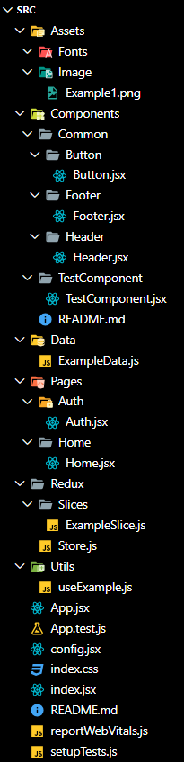

# Project Folder Structure

This document outlines the folder structure of the project to maintain consistency and improve code organization.


## `Root` Directory
Contains all the project's Root files/folders.
- **node_modules/** : Contains all the project's npm dependencies.


### `src/` Directory
- **Assets/** : Contains image files, fonts, and other static resources used throughout the application.
    - **Image** : It will contain the image files
    - **Fonts** : It will contain the font files
- **Components/** : Includes reusable UI components that can be used across different parts of the application.
    - **Common/** : It will include all the common components e.g.(Button, Header, Footer, Sidebar, etc...)
    - **ComponentName/** : Folder
        - **ComponentName** : ComponentName.jsx File
    - **README.md**: Component documentation and guidelines.
- **Data** : It contains data files for development purposes only.
- **Pages/** : Contains page components, each representing a distinct route/view in the application.
  - **PageName/** : Folder
    - **PageName** : PageName.jsx File
- **Redux/** : Manages the Redux state management setup.
  - **Slices/** : Contains individual slice files for Redux state management.
  - **Store.js** : Configures and exports the Redux store.
- **Utils/** : Contains utility functions and helper methods that can be used throughout the project.



### `Root` Files
- **App.jsx** : The root component that sets up the main structure and routing of the application.
- **App.test.js** : Contains tests for the `App.jsx` component.
- **config.jsx** : Configuration settings for the application.
- **index.css** : Global CSS file for the application.
- **index.html** : The main HTML file that includes the root div where the React app mounts.
- **index.jsx** : Entry point for the React application, rendering the `App` component and setting up the ReactDOM.
- **package-lock.json** : Automatically generated file that describes the exact dependency tree based on `package.json`.
- **postcss.config.js** : Configuration file for PostCSS.
- **README.md**: Project documentation and guidelines.
- **reportWebVitals.js** : Used for measuring the performance of the application.
- **setupTests.js** : Configuration for setting up testing environments.
- **vite.config.mjs** : Configuration file for Vite.

### Summary
This folder structure promotes a clear separation of concerns, making the project easier to navigate, maintain, and scale. Each directory and file serves a specific purpose, ensuring the codebase remains organized and manageable as the project grows.

---
&emsp;


# App.js optimizations

##### (19/06/2024)

### Optimized `useEffect` Hook

In the new version, two `useEffect` hooks were merged into one for better efficiency and maintainability.

#### Old Code

```javascript
useEffect(() => {
  const navbar = document.getElementById("navBarId");
  const height = navbar.offsetHeight;
  setNavBarHeight(height + 20);
}, []);

useEffect(() => {
  const leftPanel = document.getElementById("leftPanelId");

  const resizeObserver = new ResizeObserver((entries) => {
    const newWidth = entries[0].contentRect.width;
    setLeftPanelWidth(newWidth + 50); // Update state with padding
    leftPanelWidthRef.current = newWidth; // Update reference
  });

  resizeObserver.observe(leftPanel);

  return () => resizeObserver.disconnect(); // Cleanup on unmount
}, []);
```

#### New Code

```javascript
useEffect(() => {
  const leftPanel = document.getElementById("leftPanelId");
  const navbar = document.getElementById("navBarId");
  const height = navbar.offsetHeight;
  setNavBarHeight(height + 20);

  const resizeObserver = new ResizeObserver((entries) => {
    const newWidth = entries[0].contentRect.width;
    setLeftPanelWidth(newWidth + 50); // Update state with padding
    leftPanelWidthRef.current = newWidth; // Update reference
  });

  resizeObserver.observe(leftPanel);

  return () => resizeObserver.disconnect(); // Cleanup on unmount
}, []);
```

### Benefits

1. **Reduced Hooks:** Merged two hooks into one for simplicity.
2. **Improved Readability:** Consolidated related logic in one place.
3. **Proper Cleanup:** Ensured single cleanup function for observers.

---

&emsp;

# LeftPanel.jsx Optimizations
##### (19/06/2024)
### Optimized `SVG` element creation

This update consolidates two similar SVG elements within a conditional render block for a cleaner and more maintainable codebase.

#### Old Code

```jsx
<div className="bg-indigo-600 h-6 w-6 rounded-full p-1">
  {open ? (
    <svg
      xmlns="http://www.w3.org/2000/svg"
      className="h-4 w-4 text-white"
      fill="none"
      viewBox="0 0 24 24"
      stroke="currentColor"
    >
      <path
        strokeLinecap="round"
        strokeLinejoin="round"
        strokeWidth="2"
        d="M15 19l-7-7 7-7"
      />
    </svg>
  ) : (
    <svg
      xmlns="http://www.w3.org/2000/svg"
      className="h-4 w-4 text-white"
      fill="none"
      viewBox="0 0 24 24"
      stroke="currentColor"
    >
      <path
        strokeLinecap="round"
        strokeLinejoin="round"
        strokeWidth="2"
        d="M9 5l7 7-7 7"
      />
    </svg>
  )}
</div>
```

#### New Code

```jsx
<div
  className="bg-indigo-600 h-6 w-6 rounded-full p-1"
  onClick={() => setOpen(!open)}
>
  <svg
    xmlns="http://www.w3.org/2000/svg"
    className={`h-4 w-4 text-white transition-transform duration-300 ${
      open ? "rotate-180" : ""
    }`}
    fill="none"
    viewBox="0 0 24 24"
    stroke="currentColor"
  >
    <path
      strokeLinecap="round"
      strokeLinejoin="round"
      strokeWidth="2"
      d="M9 5l7 7-7 7"
    />
  </svg>
</div>
```

### Benefits

1. **Consistency:** Ensures uniform rendering for both SVG icons.
2. **Maintainability:** Simplifies code, making it easier to manage and update.
3. **Clarity:** Improves readability by reducing redundancy.

---


