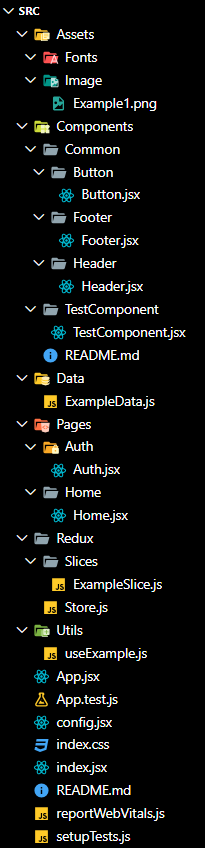
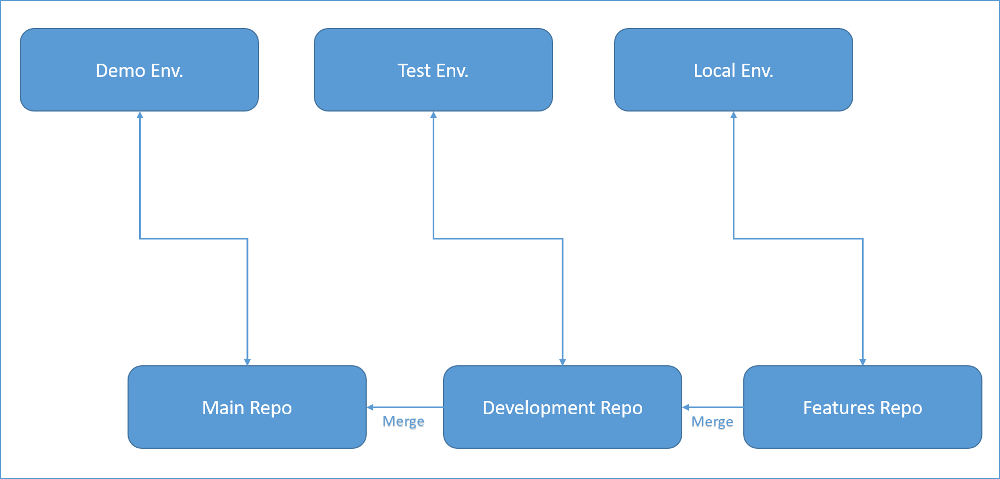

# 1 - Project Folder Structure

This document outlines the folder structure of the project to maintain consistency and improve code organization.


## `Root` Directory
Contains all the project's Root files/folders.
- **node_modules/** : Contains all the project's npm dependencies.


### `src/` Directory
- **Assets/** : Contains image files, fonts, and other static resources used throughout the application.
    - **Image** : It will contain the image files
    - **Fonts** : It will contain the font files
- **Components/** : Includes reusable UI components that can be used across different parts of the application.
    - **Common/** : It will include all the common components e.g.(Button, Header, Footer, Sidebar, etc...)
    - **ComponentName/** : Folder
        - **ComponentName** : ComponentName.jsx File
    - **README.md**: Component documentation and guidelines.
- **Data** : It contains data files for development purposes only.
- **Pages/** : Contains page components, each representing a distinct route/view in the application.
  - **PageName/** : Folder
    - **PageName** : PageName.jsx File
- **Redux/** : Manages the Redux state management setup.
  - **Slices/** : Contains individual slice files for Redux state management.
  - **Store.js** : Configures and exports the Redux store.
- **Utils/** : Contains utility functions and helper methods that can be used throughout the project.



### `Root` Files
- **App.jsx** : The root component that sets up the main structure and routing of the application.
- **App.test.js** : Contains tests for the `App.jsx` component.
- **config.jsx** : Configuration settings for the application.
- **index.css** : Global CSS file for the application.
- **index.html** : The main HTML file that includes the root div where the React app mounts.
- **index.jsx** : Entry point for the React application, rendering the `App` component and setting up the ReactDOM.
- **package-lock.json** : Automatically generated file that describes the exact dependency tree based on `package.json`.
- **postcss.config.js** : Configuration file for PostCSS.
- **README.md**: Project documentation and guidelines.
- **reportWebVitals.js** : Used for measuring the performance of the application.
- **setupTests.js** : Configuration for setting up testing environments.
- **vite.config.mjs** : Configuration file for Vite.

### Summary
This folder structure promotes a clear separation of concerns, making the project easier to navigate, maintain, and scale. Each directory and file serves a specific purpose, ensuring the codebase remains organized and manageable as the project grows.

---
&emsp;

# 2 - Component Documentation Template
# [ComponentName]

### Description
[ComponentName] is a React component designed to [brief description of what the component does]. This component is responsible for [specific functionalities or features].

### Purpose
The primary purpose of [ComponentName] is to [explanation of why this component was created]. It aims to [specific goals or improvements, such as enhancing user experience, providing new functionality, or optimizing performance].

### Features
- [Feature 1: Detailed description of the feature]
- [Feature 2: Detailed description of the feature]
- [Feature 3: Detailed description of the feature]

### Usage
To use the [ComponentName] component, follow the example below:

```jsx
import [ComponentName] from './Components/[ComponentName]';

// Usage within a parent component
function ParentComponent() {
  return (
    <div>
      <Header />
      <[ComponentName] />
      <Footer />
    </div>
  );
}
```

### Props
The [ComponentName] component accepts the following props:

| Prop Name     | Type     | Description                                               | Default Value |
|---------------|----------|-----------------------------------------------------------|---------------|
| `propName1`   | `type1`  | Description of what propName1 does                        | `default1`    |
| `propName2`   | `type2`  | Description of what propName2 does                        | `default2`    |
| `propName3`   | `type3`  | Description of what propName3 does                        | `default3`    |

### Example
Here is a more detailed example of how to implement [ComponentName]:

```jsx
import React from 'react';
import [ComponentName] from './Components/[ComponentName]';

function ExampleComponent() {
  return (
    <div>
      <[ComponentName]
        propName1="value1"
        propName2="value2"
        propName3="value3"
      />
    </div>
  );
}

export default ExampleComponent;
```

### Additional Notes
- Ensure that [any important considerations or prerequisites].
- [Additional notes or caveats about using the component].

---


&emsp;

# 3 - Creating Component Documentation Using Component Documentation Template With ChatGPT

You are supposed to give all the details in one prompt. 

## Commands:
1. Use the provided template in readme format.
2. Paste the template directly.
3. Generate a readme using the template for your specific code.
4. Share your entire code for processing.

---

&emsp;

# 4 - Code Migrations 

To manage code migration and merging across different branches and environments, it's important to establish a clear workflow that aligns with your development, testing, and deployment processes. Here’s a structured approach to handle code migration from your `features` branch to the `development` branch and finally to the `main` branch, each corresponding to `Local`, `Test`, and `Demo` environments respectively:



### Workflow Overview

1. **Feature Development (Local Environment)**
    - **Branch:** `features`
    - **Environment:** Local
    - **API Endpoints:** Local endpoints for development

2. **Testing (Test Environment)**
    - **Branch:** `Development`
    - **Environment:** Test
    - **API Endpoints:** Test endpoints

3. **Deployment (Demo Environment)**
    - **Branch:** `Main`
    - **Environment:** Demo
    - **API Endpoints:** Demo endpoints

### Detailed Workflow

#### 1. Feature Development

- **Develop Features:**
    - Developers work on the `features` branch locally.
    - Use local API endpoints suitable for development.
    
- **Commit and Push:**
    - Commit changes to the `features` branch.
    - Push the `features` branch to the remote repository.

#### 2. Code Review and Merge to Development

- **Create Pull Request:**
    - Once features are developed and tested locally, create a pull request (PR) from `features` to `Development`.
    
- **Code Review:**
    - Conduct a code review. Address any feedback and make necessary changes.
    
- **Merge to Development:**
    - Once the PR is approved, merge `features` into `Development`.
    - Resolve any merge conflicts if they arise.

- **Test Environment Deployment:**
    - Deploy the `Development` branch to the test environment.
    - Update API endpoints in the configuration to use the test environment endpoints.

- **Testing:**
    - Perform thorough testing in the test environment.
    - Fix any bugs and push fixes to the `Development` branch.

#### 3. Merge to Main for Demo

- **Create Pull Request:**
    - Once testing is successful, create a pull request from `Development` to `Main`.
    
- **Code Review:**
    - Conduct a final review. Address any feedback and make necessary changes.
    
- **Merge to Main:**
    - Once the PR is approved, merge `Development` into `Main`.
    - Resolve any merge conflicts if they arise.

- **Demo Environment Deployment:**
    - Deploy the `Main` branch to the demo environment.
    - Update API endpoints in the configuration to use the demo environment endpoints.

- **Demo Testing:**
    - Perform final testing in the demo environment.
    - Ensure everything works as expected.

### Handling API Endpoint Changes

To handle different API endpoints across environments, you can use environment-specific configuration files or environment variables. Here's a basic example using environment variables:

1. **Local Environment Configuration:**
    ```bash
    export API_ENDPOINT="http://localhost:3000/api"
    ```

2. **Test Environment Configuration:**
    ```bash
    export API_ENDPOINT="http://test.api.example.com/api"
    ```

3. **Demo Environment Configuration:**
    ```bash
    export API_ENDPOINT="http://demo.api.example.com/api"
    ```

In your code, you can access these environment variables:

```javascript
const apiEndpoint = process.env.API_ENDPOINT;
```

### Summary

- **Develop** features on the `features` branch using local endpoints.
- **Merge** features into the `Development` branch for testing, updating endpoints for the test environment.
- **Merge** tested code into the `Main` branch for deployment to the demo environment, updating endpoints accordingly.

This workflow ensures that code is progressively tested and integrated, reducing the likelihood of bugs in the production environment. Adjust the specifics to fit your team's processes and tools.


&emsp;


# 5 - Component Optimizations
# App.jsx optimizations

##### (19/06/2024)

### Optimized `useEffect` Hook

In the new version, two `useEffect` hooks were merged into one for better efficiency and maintainability.

#### **Before:**

```javascript
useEffect(() => {
  const navbar = document.getElementById("navBarId");
  const height = navbar.offsetHeight;
  setNavBarHeight(height + 20);
}, []);

useEffect(() => {
  const leftPanel = document.getElementById("leftPanelId");

  const resizeObserver = new ResizeObserver((entries) => {
    const newWidth = entries[0].contentRect.width;
    setLeftPanelWidth(newWidth + 50); // Update state with padding
    leftPanelWidthRef.current = newWidth; // Update reference
  });

  resizeObserver.observe(leftPanel);

  return () => resizeObserver.disconnect(); // Cleanup on unmount
}, []);
```

#### **After:**

```javascript
useEffect(() => {
  const leftPanel = document.getElementById("leftPanelId");
  const navbar = document.getElementById("navBarId");
  const height = navbar.offsetHeight;
  setNavBarHeight(height + 20);

  const resizeObserver = new ResizeObserver((entries) => {
    const newWidth = entries[0].contentRect.width;
    setLeftPanelWidth(newWidth + 50); // Update state with padding
    leftPanelWidthRef.current = newWidth; // Update reference
  });

  resizeObserver.observe(leftPanel);

  return () => resizeObserver.disconnect(); // Cleanup on unmount
}, []);
```

### Benefits

1. **Reduced Hooks:** Merged two hooks into one for simplicity.
2. **Improved Readability:** Consolidated related logic in one place.
3. **Proper Cleanup:** Ensured single cleanup function for observers.

---

&emsp;

# LeftPanel.jsx -> SideBar.jsx Optimizations
##### (19/06/2024)
This document outlines the optimizations made to the `LeftPanel` component to improve readability, reduce redundancy, and enhance performance.

## Optimizations
### Optimized `SVG` element creation

This update consolidates two similar SVG elements within a conditional render block for a cleaner and more maintainable codebase.

#### **Before:**

```jsx
<div className="bg-indigo-600 h-6 w-6 rounded-full p-1">
  {open ? (
    <svg
      xmlns="http://www.w3.org/2000/svg"
      className="h-4 w-4 text-white"
      fill="none"
      viewBox="0 0 24 24"
      stroke="currentColor"
    >
      <path
        strokeLinecap="round"
        strokeLinejoin="round"
        strokeWidth="2"
        d="M15 19l-7-7 7-7"
      />
    </svg>
  ) : (
    <svg
      xmlns="http://www.w3.org/2000/svg"
      className="h-4 w-4 text-white"
      fill="none"
      viewBox="0 0 24 24"
      stroke="currentColor"
    >
      <path
        strokeLinecap="round"
        strokeLinejoin="round"
        strokeWidth="2"
        d="M9 5l7 7-7 7"
      />
    </svg>
  )}
</div>
```

#### **After:**

```jsx
<div
  className="bg-indigo-600 h-6 w-6 rounded-full p-1"
  onClick={() => setOpen(!open)}
>
  <svg
    xmlns="http://www.w3.org/2000/svg"
    className={`h-4 w-4 text-white transition-transform duration-300 ${
      open ? "rotate-180" : ""
    }`}
    fill="none"
    viewBox="0 0 24 24"
    stroke="currentColor"
  >
    <path
      strokeLinecap="round"
      strokeLinejoin="round"
      strokeWidth="2"
      d="M9 5l7 7-7 7"
    />
  </svg>
</div>
```


### Combined Similar `useEffect` Hooks
Consolidated multiple `useEffect` hooks into one to streamline menu updates.

**Before:**
```jsx
useEffect(() => {
  setMenus((prevMenus) =>
    prevMenus.map((menu) => {
      if (menu.title === "RAC") {
        return { ...menu, submenuItems: RACDataInfo };
      }
      return menu;
    })
  );
}, [RACDataInfo]);

useEffect(() => {
  setMenus((prevMenus) =>
    prevMenus.map((menu) => {
      if (menu.title === "Project") {
        return { ...menu, submenuItems: ProjectDataInfo };
      }
      return menu;
    })
  );
}, [ProjectDataInfo]);

useEffect(() => {
  setMenus((prevMenus) =>
    prevMenus.map((menu) => {
      if (menu.title === "Product") {
        return { ...menu, submenuItems: ProductDataInfo };
      }
      return menu;
    })
  );
}, [ProductDataInfo]);
```

**After:**
```jsx
useEffect(() => {
  setMenus((prevMenus) =>
    prevMenus.map((menu) => {
      if (menu.title === "RAC") {
        return { ...menu, submenuItems: RACDataInfo };
      }
      if (menu.title === "Project") {
        return { ...menu, submenuItems: ProjectDataInfo };
      }
      if (menu.title === "Product") {
        return { ...menu, submenuItems: ProductDataInfo };
      }
      return menu;
    })
  );
}, [RACDataInfo, ProjectDataInfo, ProductDataInfo]);
```

### Optimized State Updates
Simplified state update logic for submenu states.

**Before:**
```jsx
const toggleSubmenu = (index) => {
  setSubmenuStates(
    Menus.map((menu, i) =>
      i === index && menu.submenu
        ? { isOpen: !submenuStates[index].isOpen }
        : submenuStates[i]
    )
  );
};
```

**After:**
```jsx
const toggleSubmenu = (index) => {
  setSubmenuStates(
    submenuStates.map((state, i) =>
      i === index ? { isOpen: !state.isOpen } : state
    )
  );
};
```
## Future Optimizations:
Refactor Nested Mapping:

Currently, you're mapping over Menus and its submenuItems within the JSX. Consider refactoring this logic into separate components or functions for better separation of concerns and improved code readability.
Memoization for Hooks:

To prevent unnecessary re-renders and optimize performance, consider using memoization techniques (useMemo, useCallback) for hooks like useRACInfo, useAllProjectInfo, useProductInfo. This ensures that expensive computations are memoized and only recalculated when dependencies change.
Error Handling in Hooks:

Implement error handling mechanisms within custom hooks (useRACInfo, useAllProjectInfo, useProductInfo) to gracefully manage and display errors when data fetching fails.
Accessibility and Keyboard Navigation:

Ensure accessibility standards are met by improving keyboard navigation and focus management within the sidebar and submenu items. Use role, aria-* attributes where necessary.
Testing and Optimization of Rendering Performance:

Conduct performance profiling to identify potential bottlenecks and optimize rendering performance, especially when dealing with large datasets or complex UI interactions.
Code Splitting and Lazy Loading:

Consider implementing code splitting and lazy loading techniques, especially if the application grows in size. This can significantly improve initial load times by deferring the loading of less critical parts of the application until they are needed.
Type Safety and PropTypes:


## Summary
These optimizations improve the `LeftPanel` component by reducing redundancy, enhancing readability, and boosting performance.

---

&emsp;


# Header.jsx Component Optimization

This document outlines the optimizations made to the `Header` component in your React project. The changes focus on improving performance, readability, and maintainability.

## Key Optimizations

1. **Memoization of `userNavigation` Array**
2. **Extraction of Subcomponents**
3. **Simplification of Conditional CSS Classes**

### Memoization of `userNavigation` Array

The `userNavigation` array was being recreated on every render. By using the `useMemo` hook, we can ensure that the array is only recreated when its dependencies change. This helps in optimizing performance by preventing unnecessary re-renders.

**Before:**
```javascript
const userNavigation = [
  { name: "Your Profile", href: "#" },
  { name: "Settings", href: "#" },
  { name: "Sign out", href: "/login", function: () => localStorage.clear() },
];
```

**After:**
```javascript
import React, { useMemo } from 'react';

const Header = () => {
  const userNavigation = useMemo(() => [
    { name: 'Your Profile', href: '#' },
    { name: 'Settings', href: '#' },
    { name: 'Sign out', href: '/login', action: () => localStorage.clear() },
  ], []);
  // Rest of the component
};
```

### Extraction of Subcomponents

To enhance readability and maintainability, we extracted complex JSX elements into smaller, reusable subcomponents. This modular approach makes the `Header` component cleaner and easier to understand.

**Before:**
```javascript
// Complex JSX directly in the Header component
```

**After:**
```javascript
const NotificationButton = () => (
  <Link to="/notification">
    <button
      type="button"
      className="relative ml-5 flex-shrink-0 rounded-full bg-white p-1 text-gray-400 hover:text-gray-500 focus:outline-none focus:ring-2 focus:ring-indigo-500 focus:ring-offset-2"
    >
      <span className="absolute -inset-1.5" />
      <span className="sr-only">View notifications</span>
      <BellIcon className="h-6 w-6" aria-hidden="true" />
    </button>
  </Link>
);

const UserMenu = ({ userNavigation }) => (
  <Menu as="div" className="relative">
    <div className="flex items-center gap-2">
      <Menu.Button className="relative flex rounded-full bg-white focus:outline-none focus:ring-2 focus:ring-indigo-500 focus:ring-offset-2">
        <span className="absolute -inset-1.5" />
        <span className="sr-only">Open user menu</span>
        
      </Menu.Button>
      <div className="text-gray-500">Hello, {localStorage.getItem('username')}</div>
    </div>
    <Transition
      enter="transition ease-out duration-100"
      enterFrom="transform opacity-0 scale-95"
      enterTo="transform opacity-100 scale-100"
      leave="transition ease-in duration-75"
      leaveFrom="transform opacity-100 scale-100"
      leaveTo="transform opacity-0 scale-95"
    >
      <Menu.Items className="absolute right-0 z-10 mt-2 w-48 origin-top-right rounded-md bg-white py-1 shadow-lg ring-1 ring-black ring-opacity-5 focus:outline-none">
        {userNavigation.map(item => (
          <Menu.Item key={item.name}>
            {({ active }) => (
              <Link
                to={item.href}
                className={`block px-4 py-2 text-sm ${active ? 'bg-gray-100 text-gray-700' : 'text-gray-700'}`}
                onClick={item.action}
              >
                {item.name}
              </Link>
            )}
          </Menu.Item>
        ))}
      </Menu.Items>
    </Transition>
  </Menu>
);

const CreateMenu = () => (
  <Menu as="div" className="relative">
    <Menu.Button className="rounded-full bg-indigo-600 p-2 text-white shadow-sm hover:bg-indigo-500 focus-visible:outline focus-visible:outline-2 focus-visible:outline-offset-2 focus-visible:outline-indigo-600">
      <PlusIcon className="h-5 w-5" aria-hidden="true" />
    </Menu.Button>
    <Transition
      enter="transition ease-out duration-100"
      enterFrom="transform opacity-0 scale-95"
      enterTo="transform opacity-100 scale-100"
      leave="transition ease-in duration-75"
      leaveFrom="transform opacity-100 scale-100"
      leaveTo="transform opacity-0 scale-95"
    >
      <Menu.Items className="absolute right-2 z-10 mt-2 w-56 origin-top-right rounded-md bg-white shadow-lg ring-1 ring-black ring-opacity-5 focus:outline-none">
        <div className="py-1">
          {[
            { to: '/create-rac', text: 'RAC' },
            { to: '/project/newProject', text: 'Project' },
            { to: '/create-product', text: 'Product' },
            { to: '/group/1', text: 'Group' },
            { to: '/business-rule/1', text: 'Business Rule' },
          ].map(item => (
            <Menu.Item key={item.to}>
              {({ active }) => (
                <Link
                  to={item.to}
                  className={`block px-4 py-2 text-sm ${active ? 'bg-gray-100 text-gray-900' : 'text-gray-700'}`}
                >
                  {item.text}
                </Link>
              )}
            </Menu.Item>
          ))}
        </div>
      </Menu.Items>
    </Transition>
  </Menu>
);

// Header component using subcomponents
const Header = () => {
  const userNavigation = useMemo(() => [
    { name: 'Your Profile', href: '#' },
    { name: 'Settings', href: '#' },
    { name: 'Sign out', href: '/login', action: () => localStorage.clear() },
  ], []);

  return (
    <header className="shadow-md bg-white z-50 w-full fixed top-0 left-0 flex items-center justify-between" id="navBarId">
      <div className="w-1/3">&nbsp;</div>
      <div className="flex justify-center w-1/3">
        <div>
          <label htmlFor="search" className="sr-only">Search</label>
          {/* Uncomment and customize the search input if needed */}
          {/* <div className="relative">
            <div className="pointer-events-none absolute inset-y-0 left-0 flex items-center pl-3">
              <MagnifyingGlassIcon className="h-5 w-5 text-gray-400" aria-hidden="true" />
            </div>
            <input
              id="search"
              name="search"
              className="block w-full rounded-md border-0 bg-white py-1.5 pl-10 pr-3 text-gray-900 ring-1 ring-inset ring-gray-300 placeholder:text-gray-400 focus:ring-2 focus:ring-inset focus:ring-indigo-500 sm:text-sm sm:leading-6"
              placeholder="Search"
              type="search"
            />
          </div> */}
        </div>
      </div>
      <div className="px-8 py-3 relative flex justify-end items-end gap-8 w-1/3">
        <NotificationButton />
        <UserMenu userNavigation={userNavigation} />
        <CreateMenu />
      </div>
    </header>
  );
};

export default Header;
```

### Simplification of Conditional CSS Classes

The conditional application of CSS classes has been simplified for better readability. This involves using template literals to conditionally apply classes in a more concise and readable manner.

**Before:**
```javascript
className={
  active ? "bg-gray-100 block px-4 py-2 text-sm text-gray-700" : "block px-4 py-2 text-sm text-gray-700"
}
```

**After:**
```javascript
className={`block px-4 py-2 text-sm ${active ? 'bg-gray-100 text-gray-700' : 'text-gray-700'}`}
```

## Summary

These optimizations enhance the performance, readability, and maintainability of the `Header` component. By memoizing the `userNavigation` array, extracting complex JSX into subcomponents, and simplifying CSS class application, the code becomes more efficient and easier to manage.

---


&emsp;


# Footer.jsx Component Optimization 

**Before:**
```javascript
const Footer = ({ mgLeft }) => {
  const year = new Date().getFullYear();
  return (
    <>
      <footer style={{ marginLeft: `${mgLeft}px` }} className="mt-auto">
        <div className=" text-grey-700 py-3 mt-20 text-sm">
          <div className="container">
            <div className="flex justify-between">
              <div> © {year} All Rights Reserved</div>
              <div>powered by PhotonMatters</div>
            </div>
          </div>
        </div>
      </footer>
    </>
  );
};
```

**After:**
```javascript
import React from 'react';

const Footer = ({ mgLeft }) => {
  const year = new Date().getFullYear();
  return (
    <footer style={{ marginLeft: mgLeft }} className="mt-auto text-grey-700 py-3 mt-20 text-sm container flex justify-between">
      <div>© {year} All Rights Reserved</div>
      <div>Powered by PhotonMatters</div>
    </footer>
  );
};

export default Footer;
```

## Summary
- Simplified inline style handling for `marginLeft`.
- Consolidated and simplified class names for cleaner styling.
- Improved structure by eliminating unnecessary nesting and fragments.

---

&emsp;

# Body.jsx -> HomePage Optimization Breakdown

The new code has been optimized in several key ways, making it more modular, maintainable, and reusable. Here's a breakdown of the optimizations:

1. **Modular Structure:**
   - **Old Code:**
     - The `Body` component contained all the logic for rendering the stats and the product table in a single component, making it monolithic and harder to manage.
   - **New Code:**
     - The logic is split into separate, smaller components (`Body`, `StatContainer`, `StatCard`), each with a single responsibility. This improves readability and maintainability.

2. **Data Separation:**
   - **Old Code:**
     - The stats data was hard-coded within the same file as the component.
   - **New Code:**
     - The stats data (`HomeStats`) is separated into a different file (`../data/HomeStats`). This makes it easier to manage and update the data independently from the component logic.

3. **Reuse of Components:**
   - **Old Code:**
     - The `Body` component directly contained the HTML and JSX for rendering each stat card.
   - **New Code:**
     - The `StatCard` component is created for individual stat cards, allowing for reuse and easier updates.
     - The `StatContainer` component wraps the collection of `StatCard` components.

4. **Dynamic Class Assignment:**
   - **Old Code:**
     - Used a utility function `classNames` to conditionally apply classes.
   - **New Code:**
     - Simplified the conditional class application directly within the JSX using template literals.

5. **Functional Decomposition:**
   - **Old Code:**
     - Mixed different concerns in a single component.
   - **New Code:**
     - Separated concerns by dividing the functionality into different components (`Body`, `StatContainer`, `StatCard`), making the code cleaner and easier to test.

6. **Improved Readability and Maintainability:**
   - **Old Code:**
     - The logic was harder to follow due to its monolithic structure.
   - **New Code:**
     - Improved readability by creating smaller, focused components.
7. **Props and Data Management:**

    - Introduced ListName, ListHeader, and ListItem as props to customize the table's title, headers, and data dynamically. This makes the component more flexible and reusable across different parts of the application.

8. **Conditional Rendering for Links:**

    - Implemented conditional rendering in Object.keys(product).map() to selectively render table cells (<td>) as links (<Link>) based on the presence of the href property in the product object. This ensures that only clickable items are linked appropriately.

9. **CSS and Styling Improvements:**

    - Enhanced CSS classes and styling (className) to maintain consistent design principles across the application, ensuring readability and maintainability.

## Summary

#### New `HomePage` Component

```javascript
import React from 'react'
import Body from '../components/Common/Body/Body'
import ListTable from "../components/Common/ListTable/ListTable";
import { HomeStats, HeaderList, ProductList } from '../data/HomeData';
import StatContainer from '../components/Common/StatContainer/StatContainer';


const HomePage = () => {
    return (
        <Body>
            <StatContainer stats={HomeStats} />
            <ListTable ListName={"Product List"} ListHeader={HeaderList} ListItem={ProductList}/>
        </Body>
    )
}

export default HomePage
```

### HomeStats:
Contains statistics data (id, name, stat, icon, change, changeType) for displaying various metrics.
Icons imported (UsersIcon, CurrencyRupeeIcon, ClipboardDocumentListIcon) from Heroicons to visually represent each statistic.

### HeaderList:
Array of strings representing headers for the ListTable component (Name, Created On, Open Loans, Total Disbursed Principal, Status).

### ProductList:
Array of objects representing data for products (name, created, openLoans, disbursedPrincipal, status, href for linking to product details).

#### New `Body` Component

```javascript
import React from 'react';

const Body = ({ children }) => {
  return (
    <div className="mx-auto max-w-none">
      {children}
    </div>
  );
};

export default Body;
```

#### New `StatContainer` Component

```javascript
import React from 'react';
import StatCard from '../StatCard/StatCard';

const StatContainer = ({ stats }) => (
  <div className="bg-gray-100 rounded-xl mx-auto px-4 py-12 sm:px-6 lg:px-8">
    <h3 className="text-base font-semibold leading-6 text-gray-900">Last 30 days</h3>
    <dl className="mt-5 grid grid-cols-1 gap-5 sm:grid-cols-2 lg:grid-cols-3">
      {stats.map((stat) => (
        <StatCard key={stat.id} stat={stat} />
      ))}
    </dl>
  </div>
);

export default StatContainer;
```

#### New `StatCard` Component

```javascript
import React from 'react';
import { ArrowDownIcon, ArrowUpIcon } from "@heroicons/react/20/solid";

const StatCard = ({ stat }) => {
  const isIncrease = stat.changeType === "increase";
  const IconComponent = isIncrease ? ArrowUpIcon : ArrowDownIcon;
  const textColorClass = isIncrease ? "text-green-600" : "text-red-600";
  const iconColorClass = isIncrease ? "text-green-500" : "text-red-500";

  return (
    <div className="relative overflow-hidden rounded-lg bg-white px-4 pb-12 pt-5 shadow sm:px-6 sm:pt-6">
      <dt>
        <div className="absolute rounded-md bg-indigo-500 p-3">
          <stat.icon className="h-6 w-6 text-white" aria-hidden="true" />
        </div>
        <p className="ml-16 truncate text-sm font-medium text-gray-500">{stat.name}</p>
      </dt>
      <dd className="ml-16 flex items-baseline pb-6 sm:pb-7">
        <p className="text-2xl font-semibold text-gray-900">{stat.stat}</p>
        <p className={`${textColorClass} ml-2 flex items-baseline text-sm font-semibold`}>
          <IconComponent className={`h-5 w-5 flex-shrink-0 self-center ${iconColorClass}`} aria-hidden="true" />
          <span className="sr-only">
            {isIncrease ? "Increased" : "Decreased"} by{" "}
          </span>
          {stat.change}
        </p>
        <div className="absolute inset-x-0 bottom-0 bg-gray-50 px-4 py-4 sm:px-6">
          <div className="text-sm">
            <a href="#" className="font-medium text-indigo-600 hover:text-indigo-500">
              View all<span className="sr-only"> {stat.name} stats</span>
            </a>
          </div>
        </div>
      </dd>
    </div>
  );
};

export default StatCard;
```

#### New `HomeStats` Data

```javascript
import {
  ClipboardDocumentListIcon,
  CurrencyRupeeIcon,
  UsersIcon,
} from "@heroicons/react/24/outline";

export const HomeStats = [
  {
    id: 1,
    name: "Total Borrowers",
    stat: "71,897",
    icon: UsersIcon,
    change: "122",
    changeType: "increase",
  },
  {
    id: 2,
    name: "Avg. Lending / Day",
    stat: "$58.16M",
    icon: CurrencyRupeeIcon,
    change: "5.4%",
    changeType: "increase",
  },
  {
    id: 3,
    name: "Avg. Loans Closed / Day",
    stat: "24.57",
    icon: ClipboardDocumentListIcon,
    change: "3.2%",
    changeType: "decrease",
  },
];

export const HeaderList = [
  "Name",
  "Created On",
  "Open Loans",
  "Total Disbursed Principal",
  "Status",
];

export const ProductList = [
  {
    name: "Cash Loan",
    created: "07/06/2021",
    openLoans: "2367",
    disbursedPrincipal: "$234M",
    status: "Active",
    href: "/product/cash-loan/loan-product-config",
  },
  {
    name: "BNPL",
    created: "14/09/2022",
    openLoans: "1490",
    disbursedPrincipal: "$750M",
    status: "Active",
  },
  {
    name: "Overdraft",
    created: "19/09/2022",
    openLoans: "185",
    disbursedPrincipal: "$90M",
    status: "Inactive",
  },
];

```

#### New `ListTable` Component

```javascript
import React, { useState } from 'react';
import { MagnifyingGlassIcon, TrashIcon } from "@heroicons/react/20/solid";
import { Link } from "react-router-dom";

const ListTable = ({ ListName, ListHeader, ListItem, HandleAction, Searchable }) => {
  const HeaderCellWidth = ListHeader.length + 1; // Calculate cell width based on header length

  const [searchTerm, setSearchTerm] = useState('');
  const [filteredData, setFilteredData] = useState(ListItem);

  // Function to handle search input change
  const handleSearch = (event) => {
    const value = event.target.value;
    setSearchTerm(value);

    const filtered = ListItem.filter(item =>
      item.name.toLowerCase().includes(value.toLowerCase())
    );
    setFilteredData(filtered);
  };

  // Use filteredData instead of ListItem for rendering
  const dataToRender = searchTerm ? filteredData : ListItem;

  return (
    <div className="bg-gray-100 py-10 rounded-xl mt-8">
      <div className="px-4 sm:px-6 lg:px-8">
        {/* Search bar if Searchable prop is true */}
        {Searchable && (
          <div className="mb-5 w-full">
            <label htmlFor="search" className="sr-only">Search</label>
            <div className="relative">
              <div className="pointer-events-none absolute inset-y-0 left-0 flex items-center pl-3">
                <MagnifyingGlassIcon className="h-5 w-5 text-gray-400" aria-hidden="true" />
              </div>
              <input
                id="search"
                name="search"
                className="block w-full rounded-md border-0 bg-white py-1.5 pl-10 pr-3 text-gray-900 ring-1 ring-inset ring-gray-300 placeholder:text-gray-400 focus:ring-2 focus:ring-inset focus:ring-indigo-500 sm:text-sm sm:leading-6"
                placeholder="Search"
                type="search"
                value={searchTerm}
                onChange={handleSearch}
              />
            </div>
          </div>
        )}

        {/* Table title */}
        <div className="sm:flex sm:items-center">
          <div className="sm:flex-auto">
            <h1 className="text-base font-semibold leading-6 text-gray-900">{ListName}</h1>
          </div>
        </div>

        {/* Table */}
        <div className="mt-4 flow-root">
          <div className="-mx-4 -my-2 overflow-x-auto sm:-mx-6 lg:-mx-8">
            <div className="inline-block min-w-full py-2 align-middle sm:px-6 lg:px-8">
              <div className="overflow-hidden shadow ring-1 ring-black ring-opacity-5 sm:rounded-lg">
                <table className="min-w-full divide-y divide-gray-300">
                  <thead className="bg-gray-50">
                    <tr>
                      {ListHeader.map((header, index) => (
                        <th
                          key={index}
                          scope="col"
                          className={`px-3 py-3.5 w-1/${HeaderCellWidth} text-center text-sm font-medium text-gray-900`}
                        >
                          {header}
                        </th>
                      ))}
                    </tr>
                  </thead>
                  <tbody className="divide-y divide-gray-200 bg-white">
                    {dataToRender.map((product, index) => (
                      <tr key={index}>
                        {Object.keys(product).map((key, idx) => (
                          // Do not create cell for href key in the object of array
                          key !== "href" ? (
                            <td key={idx} className={`w-1/${HeaderCellWidth} whitespace-nowrap text-center py-4 px-3 text-sm text-gray-500`}>
                              {product.href ? (
                                // If product has a href attribute then create a clickable Link 
                                <Link className="w-full block" to={product.href}>
                                  {product[key]}
                                </Link>
                              ) : (
                                // Else create a simple text
                                product[key]
                              )}
                            </td>
                          ) : null
                        ))}
                        {/* Add Actions column if present */}
                        {ListHeader.includes('Actions') && (
                          <td className={`w-1/${HeaderCellWidth} whitespace-nowrap text-center py-4 px-3 text-sm text-gray-500`}>
                            <button
                              onClick={() => HandleAction(index)}
                              type="button"
                              className="w-8 h-8 rounded-full bg-red-600 p-2 text-white shadow-sm hover:bg-red-500 focus-visible:outline focus-visible:outline-2 focus-visible:outline-offset-2 focus-visible:outline-red-600"
                            >
                              <TrashIcon className="h-4 w-4" aria-hidden="true" />
                            </button>
                          </td>
                        )}
                      </tr>
                    ))}
                  </tbody>
                </table>
              </div>
            </div>
          </div>
        </div>
      </div>
    </div>
  );
};

export default ListTable;


```


## Summary
1. Split `Body` component into smaller, focused components.
2. Moved stats data to a separate file (`HomeStats`).
3. Created reusable `StatCard` component.
4. Used template literals for dynamic class assignment.
5. Improved readability with functional decomposition.
6. Enhanced maintainability with organized code structure.

These optimizations create a clear separation of concerns, improve code readability, and facilitate easier maintenance and updates.

---

&emsp;

# LoadingState.jsx Optimization Breakdown

Here's an optimized version of your `LoadingState` component. This version includes the use of React memoization to prevent unnecessary re-renders and improved accessibility by adding an `aria-label` to the loading image.

### `LoadingState.js`
```jsx
import React from 'react';
import Loader from '../../src/assets/image/loader1.gif';

const LoadingState = React.memo(() => {
  return (
    <div className="min-h-[70vh] w-full flex flex-col items-center justify-center">
      
      <p className="text-center font-bold text-xl">Fetching Data</p>
    </div>
  );
});

export default LoadingState;
```

## Summary
1. **Memoization with `React.memo`:** This optimization prevents the component from re-rendering unless its props change. Since the `LoadingState` component doesn't take any props, it will only render once, improving performance.
2. **Accessibility Improvement:** Added `aria-label="Loading"` to the image to provide better context for screen readers.

These optimizations ensure better performance and accessibility for your component.

---

&emsp;


# Tcl.js - > TclPage Optimizations BreakDown 
Here's a breakdown of the  you made in transitioning from the old code (``) to the new code (`TclPage.js`), focusing on improving modularity, maintainability, and readability:

### Optimizations Made:

1. **Modular Structure:**
   - **Old Code (Tcl.js):**
     - All logic and JSX were combined within a single component (`Tcl`), making it monolithic and harder to maintain.
   - **New Code (TclPage.js):**
     - Introduced a modular structure by extracting logic into separate components (`Body`, `StatContainer`, `ListTable`).
     - `StatContainer` component now handles the rendering of statistics (`TclStats`).
     - `ListTable` component is responsible for rendering a table (`ProductList`) with dynamic headers (`HeaderList`).

2. **Data Separation:**
   - **Old Code:**
     - Stats (`stats`) were hardcoded within the component file (`Tcl.js`).
   - **New Code:**
     - Moved stats data (`TclStats`) and table data (`HeaderList`, `ProductList`) to a separate file (`TclData.js`).
     - This separation enhances maintainability as data can be updated independently from component logic.

3. **Component Reusability:**
   - **New Code:**
     - Utilized `StatContainer` for displaying statistics (`TclStats`). This promotes reuse across different parts of the application.
     - Employed `ListTable` to display a list of TCL products (`ProductList`) with customizable headers (`HeaderList`).

4. **Improved Readability and Maintainability:**
   - **New Code:**
     - Enhanced readability by organizing JSX structure within components (`Body`, `StatContainer`, `ListTable`).
     - Reduced complexity in `TclPage.js` by delegating responsibilities to specialized components (`StatContainer` and `ListTable`).

5. **Code Simplification:**
   - **New Code:**
     - Removed unnecessary CSS classes and streamlined JSX rendering in `TclPage.js`.
     - Each component (`StatContainer`, `ListTable`) focuses on a specific responsibility, adhering to the single responsibility principle.


#### New `TclData` Component

```javascript
import {
  ClipboardDocumentListIcon,
  CurrencyRupeeIcon,
  UsersIcon,
} from "@heroicons/react/24/outline";

export const TclStats = [
  {
    id: 1,
    name: "Total Borrowers in All groups",
    stat: "71,897",
    icon: UsersIcon,
    change: "122",
    changeType: "increase",
  },
  {
    id: 2,
    name: "Avg. Lending / Day",
    stat: "$58.16M",
    icon: CurrencyRupeeIcon,
    change: "5.4%",
    changeType: "increase",
  },
  {
    id: 3,
    name: "Avg. Loans Closed / Day",
    stat: "24.57",
    icon: ClipboardDocumentListIcon,
    change: "3.2%",
    changeType: "decrease",
  },
];

export const HeaderList = [
  "Name",
  "Created On",
  "Open Loans",
  "Total Disbursed Principal",
  "Status",
];

export const ProductList = [
  {
    name: "TCL 1",
    created: "07/06/2021",
    openLoans: "2367",
    disbursedPrincipal: "$234M",
    status: "Active",
    href: "/tcl/1",
  },
  {
    name: "TCL 2",
    created: "14/09/2022",
    openLoans: "1490",
    disbursedPrincipal: "$750M",
    status: "Active",
    href: "/tcl/2",
  },
  {
    name: "TCL 3",
    created: "19/09/2022",
    openLoans: "185",
    disbursedPrincipal: "$90M",
    status: "Inactive",
    href: "/tcl/3",
  },
];
```


## Summary

- **Modularity:** Splitting logic into smaller, focused components (`StatContainer`, `ListTable`) improves code organization and reusability.
  
- **Data Separation:** Centralizing data (`TclStats`, `HeaderList`, `ProductList`) in `TclData.js` enhances maintainability and facilitates easier updates.

- **Component Reuse:** Leveraging `StatContainer` and `ListTable` promotes reuse across different pages or components within the application.

- **Readability and Maintainability:** By reducing the complexity of `TclPage.js` and distributing responsibilities among components, the code becomes easier to understand and maintain.

These optimizations collectively enhance the scalability and maintainability of your React application, aligning with best practices for modern frontend development.

---

&emsp;

# RAC.jsx -> RacPage.jsx Optimizations Overview

Here's a summary of the optimizations made in transitioning from the old code (`` and `RacTable.js`) to the new code (``, `StatContainer.js`, `StatCard.js`, and `ListTable.js`):

### Optimizations Made:

1. **Modular Structure:**
   - **Old Code (RAC.js and RacTable.js):**
     - The logic and JSX were combined within a single component (`RAC` and `RacTable`).
   - **New Code (RacPage.js, StatContainer.js, StatCard.js, and ListTable.js):**
     - Introduced a modular structure by extracting logic into separate components (`Body`, `StatContainer`, `StatCard`, `ListTable`).
     - `StatContainer` and `StatCard` components handle the rendering of statistics (`RacStats`).
     - `ListTable` component is responsible for rendering a table (`ProductList`) with dynamic headers (`HeaderList`).

2. **Data Separation:**
   - **Old Code:**
     - Stats (`stats`) and table data were hardcoded within the component file (`RAC.js` and `RacTable.js`).
   - **New Code:**
     - Moved stats data (`RacStats`) and table data (`HeaderList`, `ProductList`) to a separate file (`RacData.js`).
     - This separation enhances maintainability as data can be updated independently from component logic.

3. **Component Reusability:**
   - **New Code:**
     - Utilized `StatContainer` for displaying statistics (`RacStats`). This promotes reuse across different parts of the application.
     - Employed `ListTable` to display a list of RAC products (`ProductList`) with customizable headers (`HeaderList`).

4. **Improved Readability and Maintainability:**
   - **New Code:**
     - Enhanced readability by organizing JSX structure within components (`Body`, `StatContainer`, `StatCard`, `ListTable`).
     - Reduced complexity in `RacPage.js` by delegating responsibilities to specialized components (`StatContainer`, `ListTable`, `StatCard`).

5. **Code Simplification:**
   - **New Code:**
     - Removed unnecessary CSS classes and streamlined JSX rendering in `StatContainer.js`, `StatCard.js`, and `ListTable.js`.
     - Each component (`StatContainer`, `ListTable`, `StatCard`) focuses on a specific responsibility, adhering to the single responsibility principle.


#### New `RacData` Component

```javascript
import {
    ClipboardDocumentListIcon,
    CurrencyRupeeIcon,
    UsersIcon,
  } from "@heroicons/react/24/outline";
  
export const RacStats = [
    {
        id: 1,
        name: "Avg. Approval Daily",
        stat: "723",
        icon: UsersIcon,
        change: "122",
        changeType: "increase",
      },
      {
        id: 2,
        name: "Active RAC",
        stat: "2 / 3",
        icon: CurrencyRupeeIcon,
        change: "5.4%",
        changeType: "increase",
      },
      {
        id: 3,
        name: "Avg. Rejection / Day",
        stat: "24.57",
        icon: ClipboardDocumentListIcon,
        change: "3.2%",
        changeType: "decrease",
      },
  ];
  
  export const HeaderList = [
    "Name",
    "Created On",
    "% Approved",
    "Total Processed",
    "Status",
  ];
  
  export const ProductList = [
    {
        name: "Cash Product RAC",
        created: "07/06/2021",
        approved: "40%",
        processed: "2367",
        status: "Active",
        href: "/rac/cash-loan/rmc",
      },
      {
        name: "BNPL Product RAC",
        created: "14/09/2022",
        approved: "20%",
        processed: "750",
        status: "Active",
        href: "/rac/cash-loan/rmc",
      },
      {
        name: "Overdraft Product RAC",
        created: "19/09/2022",
        approved: "85%",
        processed: "901",
        status: "Inactive",
        href: "/rac/cash-loan/rmc",
      },
  ];
```


## Summary

- **Modularity:** Splitting logic into smaller, focused components (`StatContainer`, `StatCard`, `ListTable`) improves code organization and reusability.
  
- **Data Separation:** Centralizing data (`RacStats`, `HeaderList`, `ProductList`) in `RacData.js` enhances maintainability and facilitates easier updates.

- **Component Reuse:** Leveraging `StatContainer`, `StatCard`, and `ListTable` promotes reuse across different pages or components within the application.

- **Readability and Maintainability:** By reducing the complexity of `RacPage.js` and distributing responsibilities among components (`StatContainer`, `StatCard`, `ListTable`), the code becomes easier to understand and maintain.

These optimizations collectively enhance the scalability and maintainability of your React application, aligning with best practices for modern frontend development. Each component now encapsulates a specific part of the UI or functionality, making the codebase more modular and easier to extend or modify in the future.

---


&emsp;


# ProjectPage.jsx optimization Breakpoints

In the optimization process from the old code to the new code, several improvements and restructuring have been implemented:

1. **Modularization and Componentization**:
   - **Body Component**: Introduced a `Body` component to encapsulate common layout elements, improving code organization and maintainability.
   - **StatContainer Component**: Abstracted out the statistics rendering into a reusable `StatContainer` component, which accepts `stats` as props and iterates over them to display statistical information. This enhances reusability and separates concerns.
   - **ListTable Component**: Created a `ListTable` component to handle the rendering of tabular data. This component abstracts away the table structure and rendering logic from the main page component (`ProjectPage`), making the code more modular and easier to maintain.

2. **Data Separation**:
   - Moved static data (`RacStats`, `HeaderList`, `ProductList`) into separate data files (`RacData.js` and `ProjectData.js`). This separation of concerns ensures that data is cleanly separated from presentation logic, promoting easier updates and maintenance.

3. **Improvements in Layout and Styling**:
   - **CSS Improvements**: Enhanced CSS classes and layouts to achieve a more consistent and visually appealing design. This includes better use of spacing (`mt-5`, `mb-5`) and grid layouts (`grid-cols-1`, `grid-cols-2`, `grid-cols-3`).
   - **Responsive Design**: Ensured that the layout adapts gracefully across different screen sizes (`sm:grid-cols-2`, `lg:grid-cols-3`), improving usability across devices.

4. **Code Simplification and Readability**:
   - **Reduction of Redundancy**: Eliminated redundant or unnecessary code blocks, such as inline styles or hardcoded values.
   - **Consolidation of Components**: Consolidated similar components (`StatCard` for statistics and `ListTable` for tabular data) into reusable and focused components, reducing duplication and improving code clarity.

5. **Integration with Routing and React Features**:
   - Leveraged React Router (`Link` from `react-router-dom`) for navigation within the application, ensuring a seamless user experience when navigating between different pages or sections.
   - **React Hooks**: Utilized React Hooks (`useState`, `useEffect`) to manage state and side effects within components, enhancing the functional approach to component logic.

#### New `ProjectData` Component

```javascript
import {
    ClipboardDocumentListIcon,
    CurrencyRupeeIcon,
    UsersIcon,
  } from "@heroicons/react/24/outline";
  
export const ProjectStats = [
    {
        id: 1,
        name: "Total Borrowers",
        stat: "71,897",
        icon: UsersIcon,
        change: "122",
        changeType: "increase",
      },
      {
        id: 2,
        name: "Avg. Lending / Day",
        stat: "$58.16M",
        icon: CurrencyRupeeIcon,
        change: "5.4%",
        changeType: "increase",
      },
      {
        id: 3,
        name: "Avg. Loans Closed / Day",
        stat: "24.57",
        icon: ClipboardDocumentListIcon,
        change: "3.2%",
        changeType: "decrease",
      },
];

export const HeaderList = [
  "Name",
  "Created On",
  "Open Loans",
  "Total Disbursed Principal",
  "Status",
];

export const ProductList = [
    {
        name: "Cash Loan",
        created: "07/06/2021",
        openLoans: "2367",
        disbursedPrincipal: "$234M",
        status: "Active",
        href: "/product/cash-loan/loan-product-config",
      },
      {
        name: "BNPL",
        created: "14/09/2022",
        openLoans: "1490",
        disbursedPrincipal: "$750M",
        status: "Active",
      },
      {
        name: "Overdraft",
        created: "19/09/2022",
        openLoans: "185",
        disbursedPrincipal: "$90M",
        status: "Inactive",
      },
];

```

## Summary
Overall, these optimizations aim to enhance code maintainability, readability, and performance while adhering to best practices in React development. The modular and component-based structure allows for easier scaling and adaptation as the application grows or requirements change.

---

&emsp;

# Product.jsx -> ProductPage.jsx optimization Breakpoints

In the optimization process from the old code to the new code, several improvements and restructuring have been implemented:

### 1. Code Modularity and Reusability
- **Component Extraction**: The original code has been refactored to extract repeated and logically distinct pieces into their own components, making the code more modular and reusable.
  - **`Body`**: A wrapper component to handle layout structure.
  - **`StatContainer`**: A component to handle the statistics section.
  - **`StatCard`**: A component to handle individual statistic cards.
  - **`ListTable`**: A component to handle the product list table.

### 2. Data Separation
- **Data Centralization**: All the static data (stats, header list, product list) have been moved to a separate data file (`ProductData.js`). This makes the main component (`ProductPage`) cleaner and the data easier to manage and update.
  ```javascript
  import { ProductStats, HeaderList, ProductList } from '../data/ProductData';
  ```

### 3. Simplification and Readability
- **Cleaner JSX Structure**: The new components have a much cleaner and more readable JSX structure. The use of props to pass data and children elements improves readability and maintainability.
  - **`Body` Component**:
    ```javascript
    const Body = ({ children }) => {
      return (
        <div className="mx-auto max-w-none">
          {children}
        </div>
      );
    };
    ```
  - **`StatContainer` and `StatCard` Components**:
    ```javascript
    const StatContainer = ({ stats }) => (
      <div className="bg-gray-100 rounded-xl mx-auto px-4 py-12 sm:px-6 lg:px-8">
        <h3 className="text-base font-semibold leading-6 text-gray-900">Last 30 days</h3>
        <dl className="mt-5 grid grid-cols-1 gap-5 sm:grid-cols-2 lg:grid-cols-3">
          {stats.map((stat) => (
            <StatCard key={stat.id} stat={stat} />
          ))}
        </dl>
      </div>
    );
    ```

### 4. Consistent Data Rendering
- **Dynamic Rendering**: Using `.map()` for rendering lists of items (stats and products) ensures that the code is less prone to errors and easier to extend.
  - **Stats Rendering**:
    ```javascript
    {stats.map((stat) => (
      <StatCard key={stat.id} stat={stat} />
    ))}
    ```
  - **Product List Rendering**:
    ```javascript
    {ListItem.map((product) => (
      <tr key={product.name}>
        {Object.keys(product).map((key, idx) => (
          key !== "href" ? (
            <td key={idx} className="w-1/5 whitespace-nowrap text-center py-4 px-3 text-sm text-gray-500">
              {product.href ? (
                <Link className="w-full block" to={product.href}>
                  {product[key]}
                </Link>
              ) : (
                product[key]
              )}
            </td>
          ) : null
        ))}
      </tr>
    ))}
    ```

### 5. Improved Maintainability
- **Single Responsibility Principle**: Each component now has a single responsibility. This makes the components easier to test and maintain.
- **Readability and Scalability**: The new structure allows for easier scaling. Adding new stats or products only requires updating the data file, without changing the main components.

### 6. Styling Improvements
- **Consistent Styling**: The new code maintains consistent styling across components by keeping the style definitions close to their usage. This is evident in the `StatCard` and `ListTable` components.

## Summary
Overall, the optimizations include improved code modularity, separation of concerns, enhanced readability, maintainability, and consistent data handling. This new structure is easier to understand, extend, and maintain.

---

&emsp;

# Group.jsx -> GroupPage.jsx optimization Breakpoints

In the optimization process from the old code to the new code, several improvements and restructuring have been implemented:

### 1. **Component and File Structure Optimization:**
   - **Old Code:** The old code was organized in a single file for `Group` and `GroupTable` components.
   - **New Code:** The new code organizes components into more modular structures. `Body`, `StatContainer`, and `ListTable` components are imported from their respective paths, indicating a more modular and scalable file structure.

### 2. **Data Separation:**
   - **Old Code:** The data for stats and products was hardcoded within the components.
   - **New Code:** The new code imports `GroupStats`, `HeaderList`, and `ProductList` from a separate data file (`GroupData`). This separates data from the component logic, making it easier to manage and update.

### 3. **Component Reusability:**
   - **Old Code:** The old code had a specific implementation for the `Group` and `GroupTable` components.
   - **New Code:** The new code uses more generic and reusable components like `StatContainer` and `ListTable`. These components can be reused across different parts of the application with different data sets.

### 4. **Simplified JSX Structure:**
   - **Old Code:** The old code had a lot of inline JSX for rendering stats and the table.
   - **New Code:** The new code simplifies the JSX structure by utilizing more abstract components like `StatContainer` and `ListTable`, making the `GroupPage` component cleaner and easier to read.

### 5. **Styling and Layout:**
   - **Old Code:** Inline styling and layout-related code within components.
   - **New Code:** By using components like `Body` and others from a common directory, styling and layout are more centralized and likely consistent across the application.

### 6. **Function Utilization:**
   - **Old Code:** A `classNames` function was defined and used within the component to conditionally apply classes.
   - **New Code:** It's unclear if similar utility functions are used in the new code since the focus is on using higher-level components. However, assuming the new components like `StatContainer` and `ListTable` handle such concerns internally, this keeps the main component logic cleaner.

### 7. **Maintainability and Scalability:**
   - **Old Code:** Hardcoding within the component reduces maintainability and scalability.
   - **New Code:** By abstracting data and reusing components, the new approach enhances maintainability and scalability. Updates can be made to individual components or data sources without affecting the entire structure.

## Summary of Optimizations:
- **Component Modularity:** Better separation of components into distinct files and folders.
- **Data Management:** Separation of data from components, making updates easier.
- **Reusability:** Use of reusable components to simplify the JSX structure and reduce code duplication.
- **Clean Code:** Cleaner and more readable JSX structure.
- **Centralized Styling:** More consistent and centralized styling through common components.

These optimizations result in a more maintainable, scalable, and readable codebase.

---

&emsp;

# CustomerCare.jsx -> CustomerCarePage Optimizations BreakDown

### 1. **Component Separation**
   - **Old Code:** All functionality is inside a single `CustomerCare` component.
   - **New Code:** The functionality is split into multiple components (`CustomerCarePage`, `SearchBox`, `StatContainer`, and `Body`).

   **Benefits:**
   - Improved readability and maintainability.
   - Easier to manage, test, and debug smaller components.
   - Encourages reusability of components.

### 2. **Data and Logic Extraction**
   - **Old Code:** Stats data is directly within the component.
   - **New Code:** Stats data is moved to a separate data file (`CustomerCareData.js`).

   **Benefits:**
   - Separation of concerns: UI and data are managed separately.
   - Easier to update and maintain data without touching the UI components.

### 3. **Conditional Rendering with React Router**
   - **Old Code:** Only handles the customer care path.
   - **New Code:** Uses `useLocation` to determine the current path and conditionally execute different functions (`checkBorrowerInfoCustomer` and `checkBorrowerInfoUser`).

   **Benefits:**
   - Supports multiple routes (`/customer-care` and `/user`).
   - Makes the component dynamic and adaptable to different routes.

### 4. **Async/Await and Error Handling**
   - **Old Code:** Contains a single function to check borrower info.
   - **New Code:** Splits the logic into two separate functions (`checkBorrowerInfoCustomer` and `checkBorrowerInfoUser`) for different API endpoints and includes better error handling.

   **Benefits:**
   - Clear separation of API calls based on the route.
   - Better error handling and user feedback with conditionally rendered error messages.

### 5. **Improved JSX and CSS Management**
   - **Old Code:** JSX and CSS classes are all mixed within a single component.
   - **New Code:** Uses a cleaner JSX structure with dedicated components handling their specific parts.

   **Benefits:**
   - Cleaner JSX, easier to read and understand.
   - Separation of CSS management making it easier to update styles.

### Detailed Changes and Benefits:

#### CustomerCarePage Component

**Old Code:**

```jsx
import { useState } from "react";
import { useNavigate } from "react-router-dom";
import { ArrowDownIcon, ArrowUpIcon } from "@heroicons/react/20/solid";
import {
  ClipboardDocumentListIcon,
  CurrencyRupeeIcon,
  UsersIcon,
} from "@heroicons/react/24/outline";

const stats = [
  {
    id: 1,
    name: "Total Borrowers",
    stat: "71,897",
    icon: UsersIcon,
    change: "122",
    changeType: "increase",
  },
  {
    id: 2,
    name: "Active Borrowers",
    stat: "58,167",
    icon: CurrencyRupeeIcon,
    change: "5.4%",
    changeType: "increase",
  },
  {
    id: 3,
    name: "Inactive Borrowers",
    stat: "13,730",
    icon: ClipboardDocumentListIcon,
    change: "3.2%",
    changeType: "decrease",
  },
];

function classNames(...classes) {
  return classes.filter(Boolean).join(" ");
}
const CustomerCare = () => {
  const [borrowerID, setBorrowerID] = useState("");
  const [borrowerNotFound, setBorrowerNotFound] = useState(false);
  const navigate = useNavigate(); // Adding useNavigate  for navigation

  async function checkBorrowerInfo(borrowerID) {
    try {
      const token = localStorage.getItem("authToken");
      const data = await fetch(
        "http://10.10.10.70:32014/carbon-product-service/xcbe/api/v1/borrowers/" +
          borrowerID,
        {
          method: "GET",
          headers: {
            "Content-Type": "application/json",
            Authorization: `Bearer ${token}`,
          },
        }
      );
      if (data.status === 404) {
        console.log("Borrower Not Found"); // Clear the token
        setBorrowerNotFound(true);
        navigate("/customer-care"); // Redirect to login page
        return; // Stop further execution
      }
      // Check for token expiration or invalid token
      if (data.status === 401 || data.status === 403) {
        localStorage.removeItem("authToken"); // Clear the token
        navigate("/login"); // Redirect to login page
        return; // Stop further execution
      }
      navigate("/borrower/" + borrowerID + "/personal-info");
      setBorrowerNotFound(false);
    } catch (error) {
      console.error(error);
    }
  }

  return (
    <>
      {/* Cards */}
      <div className="bg-gray-100 rounded-xl">
        <div className="mx-auto px-4 py-12 sm:px-6 lg:px-8">
          <div>
            <h3 className="text-base font-semibold leading-6 text-gray-900">
              Last 30 days
            </h3>
            <dl className="mt-5 grid grid-cols-1 gap-5 sm:grid-cols-2 lg:grid-cols-3">
              {stats.map((item) => (
                <div
                  key={item.id}
                  className="relative overflow-hidden rounded-lg bg-white px-4 pb-12 pt-5 shadow sm:px-6 sm:pt-6"
                >
                  <dt>
                    <div className="absolute rounded-md bg-indigo-500 p-3">
                      <item.icon
                        className="h-6 w-6 text-white"
                        aria-hidden="true"
                      />
                    </div>
                    <p className="ml-16 truncate text-sm font-medium text-gray-500">
                      {item.name}
                    </p>
                  </dt>
                  <dd className="ml-16 flex items-baseline pb-6 sm:pb-7">
                    <p className="text-2xl font-semibold text-gray-900">
                      {item.stat}
                    </p>
                    <p
                      className={classNames(
                        item.changeType === "increase"
                          ? "text-green-600"
                          : "text-red-600",
                        "ml-2 flex items-baseline text-sm font-semibold"
                      )}
                    >
                      {item.changeType === "increase" ? (
                        <ArrowUpIcon
                          className="h-5 w-5 flex-shrink-0 self-center text-green-500"
                          aria-hidden="true"
                        />
                      ) : (
                        <ArrowDownIcon
                          className="h-5 w-5 flex-shrink-0 self-center text-red-500"
                          aria-hidden="true"
                        />
                      )}

                      <span className="sr-only">
                        {" "}
                        {item.changeType === "increase"
                          ? "Increased"
                          : "Decreased"}{" "}
                        by{" "}
                      </span>
                      {item.change}
                    </p>
                    <div className="absolute inset-x-0 bottom-0 bg-gray-50 px-4 py-4 sm:px-6">
                      <div className="text-sm">
                        <a
                          href="#"
                          className="font-medium text-indigo-600 hover:text-indigo-500"
                        >
                          View all
                          <span className="sr-only"> {item.name} stats</span>
                        </a>
                      </div>
                    </div>
                  </dd>
                </div>
              ))}
            </dl>
          </div>
        </div>
      </div>
      {/* --------------------------Search Bar------------------------------------- */}
      <div className="flex items-center gap-5 justify-center mt-10">
        <div>Customer ID</div>
        <div>
          <input
            type="number"
            name="borrowerID"
            id="borrowerID"
            value={borrowerID}
            onChange={(e) => {
              setBorrowerID(e.target.value);
            }}
            className="block w-full rounded-md border-0 py-1.5 text-gray-900 shadow-sm ring-1 ring-inset ring-gray-300 placeholder:text-gray-400 focus:ring-2 focus:ring-inset focus:ring-indigo-600 sm:text-sm sm:leading-6"
            placeholder="10000000000"
          />
        </div>
        <div>
          <button
            onClick={() => checkBorrowerInfo(borrowerID)}
            type="button"
            className="rounded-md bg-indigo-600 px-3 py-2 text-sm font-semibold text-white shadow-sm hover:bg-indigo-500 focus-visible:outline focus-visible:outline-2 focus-visible:outline-offset-2 focus-visible:outline-indigo-600"
          >
            Search
          </button>
        </div>
      </div>
      {borrowerNotFound && (
        <div className="text-red-600 mt-4 text-center">Borrower Not Found</div>
      )}
    </>
  );
};

export default CustomerCare;

```

**New Code:**

```jsx
import React from 'react'
import Body from '../components/Common/Body/Body'
import { CustomerCareStats } from '../data/CustomerCareData';
import StatContainer from '../components/Common/StatContainer/StatContainer';
import SearchBox from '../components/Common/SearchBox/SearchBox';

const CustomerCarePage = () => {
    return (
        <Body>
            <StatContainer stats={CustomerCareStats} />
            <SearchBox/>
        </Body>
    )
}

export default CustomerCarePage
```

**Benefits:**
- Clearly separates the page structure into `Body`, `StatContainer`, and `SearchBox` components.

#### SearchBox Component

**New Code:**

```jsx
import React, { useState } from 'react'
import { useNavigate } from 'react-router-dom';
import { useLocation } from 'react-router-dom';

const SearchBox = () => {
    const location = useLocation();
    const [borrowerID, setBorrowerID] = useState("");
    const [borrowerNotFound, setBorrowerNotFound] = useState(false);
    const navigate = useNavigate(); // Adding useNavigate  for navigation

    async function checkBorrowerInfoCustomer(borrowerID) {
        try {
            const token = localStorage.getItem("authToken");
            const data = await fetch(
                "http://10.10.10.70:32014/carbon-product-service/xcbe/api/v1/borrowers/" +
                borrowerID,
                {
                    method: "GET",
                    headers: {
                        "Content-Type": "application/json",
                        Authorization: `Bearer ${token}`,
                    },
                }
            );
            if (data.status === 404) {
                console.log("Borrower Not Found"); // Clear the token
                setBorrowerNotFound(true);
                navigate("/customer-care"); // Redirect to customer-care page
                return; // Stop further execution
            }
            // Check for token expiration or invalid token
            if (data.status === 401 || data.status === 403) {
                localStorage.removeItem("authToken"); // Clear the token
                navigate("/login"); // Redirect to login page
                return; // Stop further execution
            }
            navigate("/borrower/" + borrowerID + "/personal-info");
            setBorrowerNotFound(false);
        } catch (error) {
            console.error(error);
        }
    }

    async function checkBorrowerInfoUser(borrowerID) {
        try {
            const token = localStorage.getItem("authToken");
            const data = await fetch(
                "https://api-test.lmscarbon.com/carbon-registration-service/xcbe/api/v1/borrowers/" +
                borrowerID +
                "/check-availability/14-11-1981",
                {
                    method: "POST",
                    headers: {
                        "Content-Type": "application/json",
                        Authorization: `Bearer ${token}`,
                    },
                }
            );
            if (data.status === 404) {
                console.log("User Not Found"); // Clear the token
                setBorrowerNotFound(true);
                navigate("/user"); // Redirect to login page
                return; // Stop further execution
            }
            // Check for token expiration or invalid token
            if (data.status === 401 || data.status === 403) {
                localStorage.removeItem("authToken"); // Clear the token
                navigate("/login"); // Redirect to login page
                return; // Stop further execution
            }
            navigate("/user/" + borrowerID + "/user-info");
            setBorrowerNotFound(false);
        } catch (error) {
            console.error(error);
        }
    }

    const handleClick = () => {
        { location.pathname === '/customer-care' 
            ? checkBorrowerInfoCustomer(borrowerID) 
            : checkBorrowerInfoUser(borrowerID) 
        }
    }

    return (
        <>
            <div className="flex items-center gap-5 justify-center mt-10">
                <div>{location.pathname === '/customer-care' ? 'Customer ID' : 'Borrower ID'}</div>
                <div>
                    <input
                        type="number"
                        name="borrowerID"
                        id="borrowerID"
                        value={borrowerID}
                        onChange={(e) => {
                            setBorrowerID(e.target.value);
                        }}
                        className="block w-full rounded-md border-0 py-1.5 text-gray-900 shadow-sm ring-1 ring-inset ring-gray-300 placeholder:text-gray-400 focus:ring-2 focus:ring-inset focus:ring-indigo-600 sm:text-sm sm:leading-6"
                        placeholder="1234567890"
                    />
                </div>
                <div>
                    <button
                        onClick={handleClick}
                        type="button"
                        className="rounded-md bg-indigo-600 px-3 py-2 text-sm font-semibold text-white shadow-sm hover:bg-indigo-500 focus-visible:outline focus-visible:outline-2 focus-visible:outline-offset-2 focus-visible:outline-indigo-600"
                    >
                        Search
                    </button>
                </div>
            </div>
            {borrowerNotFound && (
                <div className="text-red-600 mt-4 text-center">Record Not Found</div>
            )}
        </>
    )
}

export default SearchBox
```

**Benefits:**
- Uses `useLocation` to determine the current path and execute the appropriate API call.
- Simplifies the logic in the `handleClick` function to decide which API call to make.
- Separates the API calls into two functions, making it easier to manage and update.

## Summary:
- **Modularity:** Code is more modular, making it easier to maintain and extend.
- **Readability:** Code is more readable and organized.
- **Reusability:** Components and data are reusable across different parts of the application.
- **Scalability:** The application structure supports future growth and additional features without significant refactoring.

By implementing these optimizations, the code becomes cleaner, more maintainable, and easier to understand, while also supporting multiple routes and improving user experience through better error handling and conditional rendering.

---
&emsp;


# UserPage.jsx -> NewUserPage.jsx Optimizations BreakDown

I have made several optimizations to the old code to enhance its structure, maintainability, and modularity. Here are the key improvements:

### Code Modularity and Reusability
1. **Separation of Concerns**:
    - **Old Code**: Mixed UI components and business logic within the same component.
    - **New Code**: Separated the logic into distinct components (`StatContainer`, `SearchBox`, and `Body`). This separation enhances readability and maintainability.

2. **Reusability**:
    - **Old Code**: Hardcoded data and repeated UI logic within the `UserPage` component.
    - **New Code**: Moved static data (`NewUserStats`) to a separate data file (`NewUserData`). The `StatContainer` component can now be reused with different stats data, making it more reusable.

### Logic Optimization
3. **Consolidation of Search Logic**:
    - **Old Code**: Had separate `checkBorrowerInfo` functions in different components with slightly different logic.
    - **New Code**: Consolidated the search logic into a single `SearchBox` component. The `handleClick` function determines the appropriate search logic based on the current path, reducing code duplication.

### Readability and Maintainability
4. **Improved Component Structure**:
    - **Old Code**: Single large component (`UserPage`) with mixed concerns.
    - **New Code**: Clean component structure with clear separation of UI and logic. The main page component (`NewUserPage`) now composes smaller, focused components.

5. **Named Exports and Consistent Naming**:
    - **Old Code**: Directly embedded data and logic within the main component.
    - **New Code**: Used named exports for stats data (`NewUserStats`), ensuring a consistent and clear naming convention.

### Example Overview
#### Old Code
```jsx
import { useState } from "react";
import { useNavigate } from "react-router-dom";
import { ArrowDownIcon, ArrowUpIcon } from "@heroicons/react/20/solid";
import {
  ClipboardDocumentListIcon,
  CurrencyRupeeIcon,
  UsersIcon,
} from "@heroicons/react/24/outline";

const stats = [
  {
    id: 1,
    name: "Total Borrowers",
    stat: "71,897",
    icon: UsersIcon,
    change: "122",
    changeType: "increase",
  },
  {
    id: 2,
    name: "Active Borrowers",
    stat: "58,167",
    icon: CurrencyRupeeIcon,
    change: "5.4%",
    changeType: "increase",
  },
  {
    id: 3,
    name: "Inactive Borrowers",
    stat: "13,730",
    icon: ClipboardDocumentListIcon,
    change: "3.2%",
    changeType: "decrease",
  },
];

function classNames(...classes) {
  return classes.filter(Boolean).join(" ");
}
const UserPage = () => {
  const [borrowerID, setBorrowerID] = useState("");
  const [borrowerNotFound, setBorrowerNotFound] = useState(false);
  const navigate = useNavigate(); // Adding useNavigate  for navigation

  async function checkBorrowerInfo(borrowerID) {
    try {
      const token = localStorage.getItem("authToken");
      const data = await fetch(
        "https://api-test.lmscarbon.com/carbon-registration-service/xcbe/api/v1/borrowers/" +
          borrowerID +
          "/check-availability/14-11-1981",
        {
          method: "POST",
          headers: {
            "Content-Type": "application/json",
            Authorization: `Bearer ${token}`,
          },
        }
      );
      if (data.status === 404) {
        console.log("User Not Found"); // Clear the token
        setBorrowerNotFound(true);
        navigate("/user"); // Redirect to login page
        return; // Stop further execution
      }
      // Check for token expiration or invalid token
      if (data.status === 401 || data.status === 403) {
        localStorage.removeItem("authToken"); // Clear the token
        navigate("/login"); // Redirect to login page
        return; // Stop further execution
      }
      navigate("/user/" + borrowerID + "/user-info");
      setBorrowerNotFound(false);
    } catch (error) {
      console.error(error);
    }
  }

  return (
    <>
      {/* Cards */}
      <div className="bg-gray-100 rounded-xl">
        <div className="mx-auto px-4 py-12 sm:px-6 lg:px-8">
          <div>
            <h3 className="text-base font-semibold leading-6 text-gray-900">
              Last 30 days
            </h3>
            <dl className="mt-5 grid grid-cols-1 gap-5 sm:grid-cols-2 lg:grid-cols-3">
              {stats.map((item) => (
                <div
                  key={item.id}
                  className="relative overflow-hidden rounded-lg bg-white px-4 pb-12 pt-5 shadow sm:px-6 sm:pt-6"
                >
                  <dt>
                    <div className="absolute rounded-md bg-indigo-500 p-3">
                      <item.icon
                        className="h-6 w-6 text-white"
                        aria-hidden="true"
                      />
                    </div>
                    <p className="ml-16 truncate text-sm font-medium text-gray-500">
                      {item.name}
                    </p>
                  </dt>
                  <dd className="ml-16 flex items-baseline pb-6 sm:pb-7">
                    <p className="text-2xl font-semibold text-gray-900">
                      {item.stat}
                    </p>
                    <p
                      className={classNames(
                        item.changeType === "increase"
                          ? "text-green-600"
                          : "text-red-600",
                        "ml-2 flex items-baseline text-sm font-semibold"
                      )}
                    >
                      {item.changeType === "increase" ? (
                        <ArrowUpIcon
                          className="h-5 w-5 flex-shrink-0 self-center text-green-500"
                          aria-hidden="true"
                        />
                      ) : (
                        <ArrowDownIcon
                          className="h-5 w-5 flex-shrink-0 self-center text-red-500"
                          aria-hidden="true"
                        />
                      )}

                      <span className="sr-only">
                        {" "}
                        {item.changeType === "increase"
                          ? "Increased"
                          : "Decreased"}{" "}
                        by{" "}
                      </span>
                      {item.change}
                    </p>
                    <div className="absolute inset-x-0 bottom-0 bg-gray-50 px-4 py-4 sm:px-6">
                      <div className="text-sm">
                        <a
                          href="#"
                          className="font-medium text-indigo-600 hover:text-indigo-500"
                        >
                          View all
                          <span className="sr-only"> {item.name} stats</span>
                        </a>
                      </div>
                    </div>
                  </dd>
                </div>
              ))}
            </dl>
          </div>
        </div>
      </div>
      {/* --------------------------Search Bar------------------------------------- */}
      <div className="flex items-center gap-5 justify-center mt-10">
        <div>Borrower ID</div>
        <div>
          <input
            type="number"
            name="borrowerID"
            id="borrowerID"
            value={borrowerID}
            onChange={(e) => {
              setBorrowerID(e.target.value);
            }}
            className="block w-full rounded-md border-0 py-1.5 text-gray-900 shadow-sm ring-1 ring-inset ring-gray-300 placeholder:text-gray-400 focus:ring-2 focus:ring-inset focus:ring-indigo-600 sm:text-sm sm:leading-6"
            placeholder="10000000000"
          />
        </div>
        <div>
          <button
            onClick={() => checkBorrowerInfo(borrowerID)}
            type="button"
            className="rounded-md bg-indigo-600 px-3 py-2 text-sm font-semibold text-white shadow-sm hover:bg-indigo-500 focus-visible:outline focus-visible:outline-2 focus-visible:outline-offset-2 focus-visible:outline-indigo-600"
          >
            Search
          </button>
        </div>
      </div>
      {borrowerNotFound && (
        <div className="text-red-600 mt-4 text-center">Borrower Not Found</div>
      )}
    </>
  );
};

export default UserPage;

```

#### New Code
```jsx
import React from 'react'
import Body from '../components/Common/Body/Body'
import { NewUserStats } from '../data/NewUserData';
import StatContainer from '../components/Common/StatContainer/StatContainer';
import SearchBox from '../components/Common/SearchBox/SearchBox';

const NewUserPage = () => {
    return (
        <Body>
            <StatContainer stats={NewUserStats} />
            <SearchBox/>
        </Body>
    )
}

export default NewUserPage;
```

### SearchBox Component
```jsx
import React, { useState } from 'react'
import { useNavigate } from 'react-router-dom';
import { useLocation } from 'react-router-dom';

const SearchBox = () => {
    const location = useLocation();
    const [borrowerID, setBorrowerID] = useState("");
    const [borrowerNotFound, setBorrowerNotFound] = useState(false);
    const navigate = useNavigate(); // Adding useNavigate  for navigation

    async function checkBorrowerInfoCustomer(borrowerID) {
        try {
            const token = localStorage.getItem("authToken");
            const data = await fetch(
                "http://10.10.10.70:32014/carbon-product-service/xcbe/api/v1/borrowers/" +
                borrowerID,
                {
                    method: "GET",
                    headers: {
                        "Content-Type": "application/json",
                        Authorization: `Bearer ${token}`,
                    },
                }
            );
            if (data.status === 404) {
                console.log("Borrower Not Found"); // Clear the token
                setBorrowerNotFound(true);
                navigate("/customer-care"); // Redirect to customer-care page
                return; // Stop further execution
            }
            // Check for token expiration or invalid token
            if (data.status === 401 || data.status === 403) {
                localStorage.removeItem("authToken"); // Clear the token
                navigate("/login"); // Redirect to login page
                return; // Stop further execution
            }
            navigate("/borrower/" + borrowerID + "/personal-info");
            setBorrowerNotFound(false);
        } catch (error) {
            console.error(error);
        }
    }

    async function checkBorrowerInfoUser(borrowerID) {
        try {
            const token = localStorage.getItem("authToken");
            const data = await fetch(
                "https://api-test.lmscarbon.com/carbon-registration-service/xcbe/api/v1/borrowers/" +
                borrowerID +
                "/check-availability/14-11-1981",
                {
                    method: "POST",
                    headers: {
                        "Content-Type": "application/json",
                        Authorization: `Bearer ${token}`,
                    },
                }
            );
            if (data.status === 404) {
                console.log("User Not Found"); // Clear the token
                setBorrowerNotFound(true);
                navigate("/user"); // Redirect to login page
                return; // Stop further execution
            }
            // Check for token expiration or invalid token
            if (data.status === 401 || data.status === 403) {
                localStorage.removeItem("authToken"); // Clear the token
                navigate("/login"); // Redirect to login page
                return; // Stop further execution
            }
            navigate("/user/" + borrowerID + "/user-info");
            setBorrowerNotFound(false);
        } catch (error) {
            console.error(error);
        }
    }

    const handleClick = () => {
        { location.pathname === '/customer-care' 
            ? checkBorrowerInfoCustomer(borrowerID) 
            : checkBorrowerInfoUser(borrowerID) 
        }
    }

    return (
        <>
            <div className="flex items-center gap-5 justify-center mt-10">
                <div>{location.pathname === '/customer-care' ? 'Customer ID' : 'Borrower ID'}</div>
                <div>
                    <input
                        type="number"
                        name="borrowerID"
                        id="borrowerID"
                        value={borrowerID}
                        onChange={(e) => {
                            setBorrowerID(e.target.value);
                        }}
                        className="block w-full rounded-md border-0 py-1.5 text-gray-900 shadow-sm ring-1 ring-inset ring-gray-300 placeholder:text-gray-400 focus:ring-2 focus:ring-inset focus:ring-indigo-600 sm:text-sm sm:leading-6"
                        placeholder="1234567890"
                    />
                </div>
                <div>
                    <button
                        onClick={handleClick}
                        type="button"
                        className="rounded-md bg-indigo-600 px-3 py-2 text-sm font-semibold text-white shadow-sm hover:bg-indigo-500 focus-visible:outline focus-visible:outline-2 focus-visible:outline-offset-2 focus-visible:outline-indigo-600"
                    >
                        Search
                    </button>
                </div>
            </div>
            {borrowerNotFound && (
                <div className="text-red-600 mt-4 text-center">Record Not Found</div>
            )}
        </>
    )
}

export default SearchBox
```

## Summary
By modularizing the code, consolidating logic, and separating concerns, the new code is more maintainable, readable, and reusable. It follows best practices in React development and makes it easier to manage and extend the application in the future.

---

&emsp;

# Ledger.jsx -> LedgerPage.jsx Optimizations BreakDown

1. **Component Structure**:
   - The old code had a single `Ledger` component, while the new code splits functionality into separate components: `CustomerCarePage`, `LedgerListTable`, and `Body`.
   - This improves code organization and reusability.

2. **Data Import**:
   - The old code had the `ledgerarr` data defined within the component. The new code imports `ledgerArr` and `HeaderList` from a separate data file (`LedgerData`).
   - This separation of concerns makes the component cleaner and data management easier.

3. **Use of Custom Components**:
   - The new code uses a `LedgerListTable` component to handle the ledger table rendering, making the `CustomerCarePage` component more readable.

4. **CSS Classes and Styles**:
   - The new code consistently uses Tailwind CSS classes for styling, making the styling more standardized and easier to read.

5. **Data Filtering and Pagination**:
   - The new code retains the filtering and pagination logic but organizes it within the `LedgerListTable` component.
   - It simplifies the filtering by removing the unused entry ID filter and keeps only the borrower ID filter.

6. **Event Handlers and Select Options**:
   - The new code improves the `handlePageSizeChange` and input change handlers by keeping them within the `LedgerListTable` component.
   - Custom styles for the `Select` component are defined using `customSelectStyles`.

7. **Table Rendering**:
   - The new code simplifies the table rendering by mapping through `ListItem` and `account` entries within the `LedgerListTable` component.
   - It uses conditional rendering to handle the case when there is no data available.

8. **Reusable Common Components**:
   - The new code uses a `Body` component for wrapping the main content, which could be reused across different pages or sections.

### Old Code
```jsx
import React, { useState, useEffect, useRef } from "react";
import { ChevronLeftIcon, ChevronRightIcon } from "@heroicons/react/20/solid";
import Select from "react-select";

// const ledgerarr = Array.from({ length: 100 }, (_, index) => {
//   const getRandomInt = (min, max) =>
//     Math.floor(Math.random() * (max - min + 1)) + min;
//   const randomDate = (start, end) => {
//     const date = new Date(
//       start.getTime() + Math.random() * (end.getTime() - start.getTime())
//     );
//     return `${date.getDate()} ${date.toLocaleString("default", {
//       month: "short",
//     })} ${date.getFullYear()}`;
//   };

//   const randomId = () => Math.random().toString(36).substr(2, 16);
//   const randomLoanId = () =>
//     `${randomId()}-eb55-44cb-be73-0403883e${getRandomInt(1000, 9999)}`;
//   const randomTransactionId = () => (Math.random() > 0.5 ? randomId() : null);
//   const randomAccount = () => {
//     const accountNames = [
//       "CASH_IN_BANK",
//       "DAYS_PAST_DUE",
//       "EARNED_INTEREST",
//       "EARNED_PRINCIPAL",
//     ];
//     const accountCodes = ["1002", "1004", "1003"];
//     const accountName = accountNames[getRandomInt(0, accountNames.length - 1)];
//     const accountCode = accountCodes[getRandomInt(0, accountCodes.length - 1)];
//     const debitValue = Math.random() > 0.5 ? getRandomInt(0, 5000) : 0;
//     const creditValue = debitValue === 0 ? getRandomInt(0, 5000) : 0;

//     return {
//       accountName,
//       accountCode,
//       debitValue,
//       creditValue,
//     };
//   };

//   return {
//     id: randomId(),
//     userId: getRandomInt(1000000000, 1999999999).toString(),
//     loanId: randomLoanId(),
//     transactionId: randomTransactionId(),
//     transactionDate: randomTransactionId()
//       ? randomDate(new Date(2023, 0, 1), new Date(2024, 5, 30))
//       : null,
//     date: randomDate(new Date(2024, 0, 1), new Date(2024, 5, 30)),
//     account: Array.from({ length: getRandomInt(1, 3) }, randomAccount),
//   };
// });

const ledgerarr = [
  {
    id: "666c7ca699ba1348a3e1c029",
    userId: "1055533324",
    loanId: "59562361-eb55-44cb-be73-0403883e8536",
    transactionId: null,
    transactionDate: null,
    date: "14 Jun 2024",
    account: [
      {
        accountName: "CASH_IN_BANK",
        accountCode: "1002",
        debitValue: 4944.5,
        creditValue: 0,
      },
      {
        accountName: "DPD_PRINCIPAL",
        accountCode: "1004",
        debitValue: 0,
        creditValue: 4000,
      },
      {
        accountName: "DPD_INTEREST",
        accountCode: "1005",
        debitValue: 0,
        creditValue: 944.5,
      },
    ],
  },
  {
    id: "666c7ca699ba1348a3e1c029",
    userId: "1055533325",
    loanId: "59562361-eb55-44cb-be73-0403883e8537",
    transactionId: null,
    transactionDate: null,
    date: "15 Jun 2024",
    account: [
      {
        accountName: "DPD_PRINCIPAL",
        accountCode: "1004",
        debitValue: 1000,
        creditValue: 0,
      },
      {
        accountName: "DPD_INTEREST",
        accountCode: "1005",
        debitValue: 100,
        creditValue: 0,
      },
      {
        accountName: "Accrued Financing Principal	",
        accountCode: "1011",
        debitValue: 0,
        creditValue: 1000,
      },
      {
        accountName: "Accrued Financing Interest",
        accountCode: "1012",
        debitValue: 0,
        creditValue: 100,
      },
    ],
  },
];

const Ledger = () => {
  const tableRef = useRef(null);
  const paginationRef = useRef(null);

  const [currentPage, setCurrentPage] = useState(1);
  const [pageSize, setPageSize] = useState(10);
  const [filteredData, setFilteredData] = useState(ledgerarr);
  const [entryIdQuery, setEntryIdQuery] = useState("");
  const [borrowerIdQuery, setBorrowerIdQuery] = useState("");

  useEffect(() => {
    const adjustPaginationWidth = () => {
      if (tableRef.current && paginationRef.current) {
        const tableWidth = tableRef.current.offsetWidth;
        paginationRef.current.style.width = `${tableWidth}px`;
      }
    };

    adjustPaginationWidth();
    window.addEventListener("resize", adjustPaginationWidth);

    return () => {
      window.removeEventListener("resize", adjustPaginationWidth);
    };
  }, []);

  // Filter by Entry ID
  useEffect(() => {
    const result = ledgerarr.filter((entry) =>
      entry.account.some((acc) => acc.accountCode.includes(entryIdQuery))
    );
    setFilteredData(result);
  }, [entryIdQuery]);

  // Filter by Borrower ID
  useEffect(() => {
    const result = ledgerarr.filter((entry) =>
      entry.userId.toString().includes(borrowerIdQuery)
    );
    setFilteredData(result);
  }, [borrowerIdQuery]);

  const totalPages = Math.ceil(filteredData.length / pageSize);
  const startIndex = (currentPage - 1) * pageSize;
  const currentData = filteredData.slice(startIndex, startIndex + pageSize);

  const handlePageSizeChange = (selectedOption) => {
    setPageSize(selectedOption.value);
    setCurrentPage(1);
  };

  // Handle entry ID search change
  const handleEntryIdChange = (event) => {
    setEntryIdQuery(event.target.value);
    setCurrentPage(1);
  };

  // Handle borrower ID search change
  const handleBorrowerIdChange = (event) => {
    setBorrowerIdQuery(event.target.value);
    setCurrentPage(1);
  };

  return (
    <>
      <div className="flex justify-start gap-5 items-center mb-4">
        {/* <div className="flex flex-col">
          <label htmlFor="entryId" className="mb-1 text-gray-700">
            Search by Entry ID
          </label>
          <input
            id="entryId"
            type="text"
            placeholder="Enter Entry ID"
            value={entryIdQuery}
            onChange={handleEntryIdChange}
            className="block rounded-md border-0 py-1.5 pr-14 text-gray-900 shadow-sm ring-1 ring-inset ring-gray-300 placeholder:text-gray-400 focus:ring-2 focus:ring-inset focus:ring-indigo-600 sm:text-sm sm:leading-6"
          />
        </div> */}
        <div className="flex flex-col">
          <label htmlFor="borrowerId" className="mb-1 text-gray-700">
            Search by Borrower ID
          </label>
          <input
            id="borrowerId"
            type="text"
            placeholder="Enter Borrower ID"
            value={borrowerIdQuery}
            onChange={handleBorrowerIdChange}
            className="block rounded-md border-0 py-1.5 pr-14 text-gray-900 shadow-sm ring-1 ring-inset ring-gray-300 placeholder:text-gray-400 focus:ring-2 focus:ring-inset focus:ring-indigo-600 sm:text-sm sm:leading-6"
          />
        </div>
        <div className="flex flex-col">
          <label htmlFor="entriesSelect" className="mb-1 text-gray-700">
            Entries Per Page
          </label>
          <Select
            id="entriesSelect"
            options={[
              { value: 5, label: "5 entries" },
              { value: 10, label: "10 entries" },
              { value: 20, label: "20 entries" },
              { value: 50, label: "50 entries" },
              { value: 100, label: "100 entries" },
            ]}
            defaultValue={{ value: 10, label: "10 entries" }}
            onChange={handlePageSizeChange}
            className="w-40"
            isSearchable={false}
            isMulti={false}
          />
        </div>
      </div>
      <table ref={tableRef} className="divide-y divide-gray-300">
        <thead>
          <tr className="divide-x divide-gray-200">
            <th className="py-3.5 px-4 text-center">Date</th>
            <th className="py-3.5 px-4 text-center">Entry ID</th>
            <th className="py-3.5 px-4 text-center text-gray-900">
              Entry Name
            </th>
            <th className="py-3.5 px-4 text-center text-gray-900">
              Borrower ID
            </th>
            <th className="py-3.5 px-4 text-center text-gray-900">Loan ID</th>
            <th className="py-3.5 px-4 text-center text-gray-900">
              Debit Amount
            </th>
            <th className="py-3.5 px-4 text-center text-gray-900">
              Credit Amount
            </th>
          </tr>
        </thead>
        <tbody className="divide-y divide-gray-200 bg-white">
          {currentData.length === 0 ? (
            <tr className="divide-x divide-gray-200 text-center w-full">
              <td colSpan="8" className="text-center py-4">
                No data available
              </td>
            </tr>
          ) : (
            currentData.map((entry, index) => (
              <React.Fragment key={index}>
                {entry.account
                  .sort((a, b) => (a.debitValue !== 0 ? -1 : 1))
                  .map((acc, subIndex) => (
                    <tr
                      key={subIndex}
                      className="divide-x divide-gray-200 text-center w-full"
                    >
                      <td className="whitespace-nowrap py-4 px-4 text-gray-500">
                        <div className="mx-auto white-space-nowrap overflow-hidden text-ellipsis">
                          {entry.date}
                        </div>
                      </td>
                      <td className="whitespace-nowrap py-4 px-4 text-gray-500">
                        <div className="mx-auto white-space-nowrap overflow-hidden text-ellipsis">
                          {acc.accountCode}
                        </div>
                      </td>
                      <td className="whitespace-nowrap py-4 px-4 text-gray-500">
                        <div className="mx-auto white-space-nowrap overflow-hidden text-ellipsis">
                          {acc.accountName.replace(/_/g, " ")}
                        </div>
                      </td>
                      <td className="whitespace-nowrap py-4 px-4 text-gray-500">
                        <div className="mx-auto white-space-nowrap overflow-hidden text-ellipsis">
                          {entry.userId}
                        </div>
                      </td>
                      <td className="whitespace-nowrap py-4 px-4 text-gray-500">
                        <div className="mx-auto white-space-nowrap overflow-hidden text-ellipsis">
                          {entry.loanId}
                        </div>
                      </td>
                      <td className="whitespace-nowrap py-4 px-4 text-gray-500">
                        <div className="mx-auto white-space-nowrap overflow-hidden text-ellipsis">
                          {acc.debitValue !== 0
                            ? acc.debitValue.toFixed(2)
                            : "-"}
                        </div>
                      </td>
                      <td className="whitespace-nowrap py-4 px-4 text-gray-500">
                        <div className="mx-auto white-space-nowrap overflow-hidden text-ellipsis">
                          {acc.creditValue !== 0
                            ? acc.creditValue.toFixed(2)
                            : "-"}
                        </div>
                      </td>
                    </tr>
                  ))}
              </React.Fragment>
            ))
          )}
        </tbody>
      </table>
      <div
        ref={paginationRef}
        className="mt-4 flex justify-center gap-5 items-center"
      >
        <button
          onClick={() => setCurrentPage(currentPage - 1)}
          disabled={currentPage === 1}
          className={`flex items-center px-4 py-2 rounded-md ${
            currentPage === 1
              ? "bg-gray-300 cursor-not-allowed"
              : "bg-indigo-500 text-white cursor-pointer"
          }`}
        >
          <ChevronLeftIcon className="w-5 h-5" />
        </button>
        <span className="text-sm text-gray-700">
          Page {currentPage} of {totalPages}
        </span>
        <button
          onClick={() => setCurrentPage(currentPage + 1)}
          disabled={currentPage === totalPages}
          className={`flex items-center px-4 py-2 rounded-md ${
            currentPage === totalPages
              ? "bg-gray-300 cursor-not-allowed"
              : "bg-indigo-500 text-white cursor-pointer"
          }`}
        >
          <ChevronRightIcon className="w-5 h-5" />
        </button>
      </div>
    </>
  );
};

export default Ledger;

```

### New Code

```jsx
import React from 'react'
import Body from '../components/Common/Body/Body'
import { ledgerArr, HeaderList } from '../data/LedgerData';
import LedgerListTable from '../components/LedgerListTable/LedgerListTable';


const CustomerCarePage = () => {
    return (
        <Body>
            <LedgerListTable ListName={"Ledger List"} ListHeader={HeaderList} ListItem={ledgerArr}/>
        </Body>
    )
}

export default CustomerCarePage

```

### LedgerListTable Component

```jsx
import React, { useState, useEffect, useRef } from "react";
import { MagnifyingGlassIcon, ChevronLeftIcon, ChevronRightIcon } from "@heroicons/react/20/solid";
import Select from "react-select";

const LedgerListTable = ({ ListName, ListHeader, ListItem }) => {
  const tableRef = useRef(null);
  const paginationRef = useRef(null);
  const [currentPage, setCurrentPage] = useState(1);
  const [pageSize, setPageSize] = useState(10);
  const [filteredData, setFilteredData] = useState(ListItem);
  const [borrowerIdQuery, setBorrowerIdQuery] = useState("");

  const totalPages = Math.ceil(filteredData.length / pageSize);
  const currentData = filteredData.slice((currentPage - 1) * pageSize, currentPage * pageSize);

  const selectOptions = [
    { value: 5, label: "5 entries" },
    { value: 10, label: "10 entries" },
    { value: 20, label: "20 entries" },
    { value: 50, label: "50 entries" },
    { value: 100, label: "100 entries" },
  ];

  useEffect(() => {
    const adjustPaginationWidth = () => {
      if (tableRef.current && paginationRef.current) {
        paginationRef.current.style.width = `${tableRef.current.offsetWidth}px`;
      }
    };

    adjustPaginationWidth();
    window.addEventListener("resize", adjustPaginationWidth);
    return () => window.removeEventListener("resize", adjustPaginationWidth);
  }, []);

  useEffect(() => {
    setFilteredData(
      ListItem.filter((entry) => entry.userId.toString().includes(borrowerIdQuery))
    );
    setCurrentPage(1);
  }, [borrowerIdQuery]);

  const handlePageSizeChange = (selectedOption) => {
    setPageSize(selectedOption.value);
    setCurrentPage(1);
  };

  // Custom Styling
  const customSelectStyles = {
    control: (provided) => ({
      ...provided,
      minHeight: '48px',
      borderRadius: '0.375rem',
      borderColor: '#D1D5DB',
      boxShadow: 'none',
    }),
    valueContainer: (provided) => ({
      ...provided,
      padding: '0 0.75rem',
    }),
    indicatorsContainer: (provided) => ({
      ...provided,
      height: '48px',
    }),
    dropdownIndicator: (provided) => ({
      ...provided,
      padding: '0 8px',
    }),
    clearIndicator: (provided) => ({
      ...provided,
      padding: '0 8px',
    }),
  };

  return (
    <div className="bg-gray-100 py-10 rounded-xl mt-8">
      <div className="px-4 sm:px-6 lg:px-8">

        {/* Search */}
        <div className="flex gap-4 mb-5">
          <div className="w-2/4">
            <label htmlFor="search" className="sr-only">
              Search by Borrower ID
            </label>
            <div className="relative">
              <div className="pointer-events-none absolute inset-y-0 left-0 flex items-center pl-3">
                <MagnifyingGlassIcon className="h-5 w-5 text-gray-400" aria-hidden="true" />
              </div>
              <input
                id="search"
                type="search"
                name="search"
                className="block w-full rounded-md border-0 bg-white py-2 pl-10 pr-3 text-gray-900 ring-1 ring-inset ring-gray-300 placeholder:text-gray-400 focus:ring-2 focus:ring-inset focus:ring-indigo-500 sm:text-sm sm:leading-6"
                placeholder="Enter Borrower ID"
                value={borrowerIdQuery}
                onChange={(e) => setBorrowerIdQuery(e.target.value)}
              />
            </div>
          </div>
          <div className="w-2/4">
            <label htmlFor="entriesSelect" className="sr-only">
              Entries Per Page
            </label>
            <Select
              id="entriesSelect"
              options={selectOptions}
              defaultValue={{ value: 10, label: "10 entries" }}
              onChange={handlePageSizeChange}
              className="block w-full"
              styles={customSelectStyles}
              isSearchable={false}
              isMulti={false}
            />
          </div>
        </div>

        {/* Table Name */}
        <div className="sm:flex sm:items-center">
          <div className="sm:flex-auto">
            <h1 className="text-base font-semibold leading-6 text-gray-900">{ListName}</h1>
          </div>
        </div>

        {/* Table */}
        <div className="mt-4 flow-root">
          <div className="-mx-4 -my-2 overflow-x-auto sm:-mx-6 lg:-mx-8">
            <div className="inline-block min-w-full py-2 align-middle sm:px-6 lg:px-8">
              <div className="overflow-hidden shadow ring-1 ring-black ring-opacity-5 sm:rounded-lg">
                <table className="min-w-full divide-y divide-gray-300" ref={tableRef}>
                  <thead className="bg-gray-50">
                    <tr>
                      {ListHeader.map((header, index) => (
                        <th
                          key={index}
                          scope="col"
                          className="px-3 py-3.5 w-1/6 text-center text-sm font-medium text-gray-900"
                        >
                          {header}
                        </th>
                      ))}
                    </tr>
                  </thead>
                  <tbody className="divide-y divide-gray-200 bg-white">
                    {currentData.length !== 0 ? (
                      currentData.map((item) => (
                        <React.Fragment key={item.id}>
                          {item.account.map((accountItem, idx) => (
                            <tr key={`${item.id}-${idx}`}>
                              <td className="w-1/6 whitespace-nowrap text-center py-4 px-3 text-sm text-gray-500">
                                {item.transactionDate}
                              </td>
                              <td className="w-1/6 whitespace-nowrap text-center py-4 px-3 text-sm text-gray-500">
                                {accountItem.entryId}
                              </td>
                              <td className="w-1/6 whitespace-nowrap text-center py-4 px-3 text-sm text-gray-500">
                                {accountItem.entryName}
                              </td>
                              <td className="w-1/6 whitespace-nowrap text-center py-4 px-3 text-sm text-gray-500">
                                {item.userId}
                              </td>
                              <td className="w-1/6 whitespace-nowrap text-center py-4 px-3 text-sm text-gray-500">
                                {accountItem.debitValue === 0 ? '-' : accountItem.debitValue}
                              </td>
                              <td className="w-1/6 whitespace-nowrap text-center py-4 px-3 text-sm text-gray-500">
                                {accountItem.creditValue === 0 ? '-' : accountItem.creditValue}
                              </td>
                            </tr>
                          ))}
                        </React.Fragment>
                      ))
                    ) : (
                      <tr>
                        <td
                          colSpan={ListHeader.length}
                          className="w-1/6 whitespace-nowrap text-center py-4 px-3 text-sm text-gray-500"
                        >
                          No Data Found
                        </td>
                      </tr>
                    )}
                  </tbody>
                </table>
              </div>
            </div>
          </div>
        </div>
      </div>

      {/* Pagination */}
      {
        currentData.length !== 0
          ? (
            <div ref={paginationRef} className="mt-4 flex justify-center gap-5 items-center">
              <button
                onClick={() => setCurrentPage(currentPage - 1)}
                disabled={currentPage === 1}
                className={`flex items-center px-4 py-2 rounded-md ${currentPage === 1 ? "bg-gray-300 cursor-not-allowed" : "bg-indigo-500 text-white cursor-pointer"
                  }`}
              >
                <ChevronLeftIcon className="w-5 h-5" />
              </button>
              <span className="text-sm text-gray-700">
                Page {currentPage} of {totalPages}
              </span>
              <button
                onClick={() => setCurrentPage(currentPage + 1)}
                disabled={currentPage === totalPages}
                className={`flex items-center px-4 py-2 rounded-md ${currentPage === totalPages ? "bg-gray-300 cursor-not-allowed" : "bg-indigo-500 text-white cursor-pointer"
                  }`}
              >
                <ChevronRightIcon className="w-5 h-5" />
              </button>
            </div>
          )
          : null
      }


    </div>
  );
};

export default LedgerListTable;


```

### LedgerData.js

```jsx
export const ledgerArr = [
  {
    id: "666c7ca699ba1348a3e1c029",
    userId: "1055533324",
    loanId: "59562361-eb55-44cb6",
    transactionId: null,
    transactionDate: "14 Jun 2024",
    account: [
      {
        entryName: "CASH_IN_BANK", 
        entryId: "1002", 
        debitValue: 4944.5,
        creditValue: 0,
      },
      {
        entryName: "DPD_PRINCIPAL",
        entryId: "1004",
        debitValue: 0,
        creditValue: 4000,
      },
      {
        entryName: "DPD_INTEREST",
        entryId: "1005",
        debitValue: 0,
        creditValue: 944.5,
      },
    ],
  },
  {
    id: "666c7ca699ba1348a3e1c029",
    userId: "1055533325",
    loanId: "59562361-eb55-44cb7",
    transactionId: null,
    transactionDate: "15 Jun 2024",
    account: [
      {
        entryName: "DPD_PRINCIPAL",
        entryId: "1004",
        debitValue: 1000,
        creditValue: 0,
      },
      {
        entryName: "DPD_INTEREST",
        entryId: "1005",
        debitValue: 100,
        creditValue: 0,
      },
      {
        entryName: "Accrued Financing Principal",
        entryId: "1011",
        debitValue: 0,
        creditValue: 1000,
      },
      {
        entryName: "Accrued Financing Interest",
        entryId: "1012",
        debitValue: 0,
        creditValue: 100,
      },
    ],
  },
];

export const HeaderList = [
  "Date",
  "Entry ID",
  "Entry Name",
  "Borrower ID",
  "Debit Amount",
  "Credit Amount",
];


```

## Summary

Overall, these changes improve the code by enhancing readability, maintainability, and reusability while maintaining the core functionality of displaying and paginating ledger entries.

---

&emsp;


# SelectAndAdd Component

This component handles the selection of a file and adding it to the list.

```jsx
import React from 'react';
import Select from 'react-select';
import { PlusIcon } from '@heroicons/react/20/solid';

// Custom Styling
const customSelectStyles = {
  control: (provided) => ({
    ...provided,
    minHeight: '48px',
    borderRadius: '0.375rem',
    borderColor: '#D1D5DB',
    boxShadow: 'none',
  }),
  valueContainer: (provided) => ({
    ...provided,
    padding: '0 0.75rem',
  }),
  indicatorsContainer: (provided) => ({
    ...provided,
    height: '48px',
  }),
  dropdownIndicator: (provided) => ({
    ...provided,
    padding: '0 8px',
  }),
  clearIndicator: (provided) => ({
    ...provided,
    padding: '0 8px',
  }),
};

const SelectAndAdd = ({ listName, selectOptions, selectedOption, handleChange, buttonName, onClick }) => {
  return (
    <div className="flex gap-4 bg-gray-100 p-10 rounded-xl">
      <div className="w-2/4">
        <label htmlFor="entriesSelect" className="sr-only">
          {listName}
        </label>
        <Select
          className="block w-full"
          options={selectOptions}
          value={selectedOption}
          onChange={handleChange}
          isMulti={false}
          isSearchable={false}
          styles={customSelectStyles}
        />
      </div>
      <div className="flex justify-center items-center">
        <button
          onClick={onClick}
          type="button"
          className="flex justify-center items-center gap-x-1 w-48 rounded-md bg-green-600 px-3 py-2.5 text-sm font-semibold text-white shadow-sm hover:bg-green-500 focus-visible:outline focus-visible:outline-2 focus-visible:outline-offset-2 focus-visible:outline-green-600"
        >
          <PlusIcon className="-ml-0.5 h-5 w-5" aria-hidden="true" />
          {buttonName}
        </button>
      </div>
    </div>
  );
};

export default SelectAndAdd;
```

# TclComponent.jsx -> TCLViewList Component
This component manages the main functionality of selecting a file and adding it to the list.

```jsx

import React, { useState } from 'react';
import { TclViewListData, TclViewListHeaderList } from '../../data/TclData';
import Body from '../Common/Body/Body';
import ListTable from '../Common/ListTable/ListTable';
import SelectAndAdd from '../Common/SelectAndAdd/SelectAndAdd';

const selectOptions = [
  { value: 'Cash Loan TCL', label: 'Cash Loan TCL' },
  { value: 'BNPL TCL', label: 'BNPL TCL' },
  { value: 'Overdraft TCL', label: 'Overdraft TCL' },
];

const TCLViewList = () => {
  const [fileSelectedOption, setFileSelectedOption] = useState(null);
  const [tableData, setTableData] = useState([]);
  const [message, setMessage] = useState('');

  const handleChange = (selectedOption) => {
    setFileSelectedOption(selectedOption);
    setMessage(''); // Reset message on selection change
  };

  const addData = () => {
    if (!fileSelectedOption) {
      setMessage('Please select a file first.');
      return;
    }

    const selectedFileData = TclViewListData.find(
      (item) => item.name === fileSelectedOption.value
    );

    if (selectedFileData) {
      const alreadyExists = tableData.some(
        (item) => item.name === selectedFileData.name
      );

      if (alreadyExists) {
        setMessage('The selected file is already added to the table.');
      } else {
        setTableData((prevData) => [selectedFileData, ...prevData]);
        setMessage(''); // Clear message if data is successfully added
      }
    }
  };

  const handleDelete = (index) => {
    setTableData((prevData) => prevData.filter((_, i) => i !== index));
  };

  return (
    <Body>
      {/* Select & Add to List */}
      <SelectAndAdd
        listName="Select TCL List"
        selectOptions={selectOptions}
        selectedOption={fileSelectedOption}
        handleChange={handleChange}
        buttonName="Add to List"
        onClick={addData}
      />

      {/* Message */}
      {message && <div className="mb-4 text-red-500">{message}</div>}

      {/* List */}
      <ListTable
        listName="TCL List"
        listHeader={TclViewListHeaderList}
        listItem={tableData}
        handleAction={handleDelete}
        searchable={false}
      />
    </Body>
  );
};

export default TCLViewList;
```

# ListTable Component
This component handles displaying the table with optional search functionality.

```jsx

import React, { useState } from 'react';
import { MagnifyingGlassIcon, TrashIcon } from '@heroicons/react/20/solid';
import { Link } from 'react-router-dom';

const ListTable = ({ listName, listHeader, listItem, handleAction, searchable }) => {
  const headerCellWidth = listHeader.length + 1; // Calculate cell width based on header length

  const [searchTerm, setSearchTerm] = useState('');
  const [filteredData, setFilteredData] = useState(listItem);

  // Function to handle search input change
  const handleSearch = (event) => {
    const value = event.target.value;
    setSearchTerm(value);

    const filtered = listItem.filter((item) =>
      item.name.toLowerCase().includes(value.toLowerCase())
    );
    setFilteredData(filtered);
  };

  // Use filteredData instead of listItem for rendering
  const dataToRender = searchTerm ? filteredData : listItem;

  return (
    <div className="bg-gray-100 py-10 rounded-xl mt-8">
      <div className="px-4 sm:px-6 lg:px-8">
        {/* Search bar if searchable prop is true */}
        {searchable && (
          <div className="mb-5 w-full">
            <label htmlFor="search" className="sr-only">
              Search
            </label>
            <div className="relative">
              <div className="pointer-events-none absolute inset-y-0 left-0 flex items-center pl-3">
                <MagnifyingGlassIcon className="h-5 w-5 text-gray-400" aria-hidden="true" />
              </div>
              <input
                id="search"
                name="search"
                className="block w-full rounded-md border-0 bg-white py-1.5 pl-10 pr-3 text-gray-900 ring-1 ring-inset ring-gray-300 placeholder:text-gray-400 focus:ring-2 focus:ring-inset focus:ring-indigo-500 sm:text-sm sm:leading-6"
                placeholder="Search"
                type="search"
                value={searchTerm}
                onChange={handleSearch}
              />
            </div>
          </div>
        )}

        {/* Table title */}
        <div className="sm:flex sm:items-center">
          <div className="sm:flex-auto">
            <h1 className="text-base font-semibold leading-6 text-gray-900">{listName}</h1>
          </div>
        </div>

        {/* Table */}
        <div className="mt-4 flow-root">
          <div className="-mx-4 -my-2 overflow-x-auto sm:-mx-6 lg:-mx-8">
            <div className="inline-block min-w-full py-2 align-middle sm:px-6 lg:px-8">
              <div className="overflow-hidden shadow ring-1 ring-black ring-opacity-5 sm:rounded-lg">
                <table className="min-w-full divide-y divide-gray-300">
                  <thead className="bg-gray-50">
                    <tr>
                      {listHeader.map((header, index) => (
                        <th
                          key={index}
                          scope="col"
                          className={`px-3 py-3.5 w-1/${headerCellWidth} text-center text-sm font-medium text-gray-900`}
                        >
                          {header}
                        </th>
                      ))}
                    </tr>
                  </thead>
                  <tbody className="divide-y divide-gray-200 bg-white">
                    {dataToRender.map((product, index) => (
                      <tr key={index}>
                        {Object.keys(product).map(
                          (key, idx) =>
                            key !== 'href' && (
                              <td
                                key={idx}
                                className={`w-1/${headerCellWidth} whitespace-nowrap text-center py-4 px-3 text-sm text-gray-500`}
                              >
                                {product.href ? (
                                  <Link className="w-full block" to={product.href}>
                                    {product[key]}
                                  </Link>
                                ) : (
                                  product[key]
                                )}
                              </td>
                            )
                        )}
                        {listHeader.includes('Actions') && (
                          <td
                            className={`w-1/${headerCellWidth} whitespace-nowrap py-4 text-center text-sm font-medium`}
                          >
                            <button
                              type="button"
                              onClick={() => handleAction(index)}
                              className="inline-flex items-center px-3 py-1.5 border border-transparent text-xs font-medium rounded shadow-sm text-white bg-red-600 hover:bg-red-700 focus:outline-none focus:ring-2 focus:ring-offset-2 focus:ring-red-500"
                            >
                              <TrashIcon className="-ml-0.5 mr-2 h-4 w-4" aria-hidden="true" />
                              Delete
                            </button>
                          </td>
                        )}
                      </tr>
                    ))}
                  </tbody>
                </table>
              </div>
            </div>
          </div>
        </div>
      </div>
    </div>
  );
};

export default ListTable;
```

# Data File (TclData.js)
This file contains the data and header information used by the components.

```javascript
import {
  ClipboardDocumentListIcon,
  CurrencyRupeeIcon,
  UsersIcon,
} from "@heroicons/react/24/outline";

export const TclStats = [
  {
    id: 1,
    name: "Total Borrowers in All groups",
    stat: "71,897",
    icon: UsersIcon,
    change: "122",
    changeType: "increase",
  },
  {
    id: 2,
    name: "Avg. Lending / Day",
    stat: "$58.16M",
    icon: CurrencyRupeeIcon,
    change: "5.4%",
    changeType: "increase",
  },
  {
    id: 3,
    name: "Avg. Loans Closed / Day",
    stat: "24.57",
    icon: ClipboardDocumentListIcon,
    change: "3.2%",
    changeType: "decrease",
  },
];

export const HeaderList = [
  "Name",
  "Created On",
  "Open Loans",
  "Total Disbursed Principal",
  "Status",
];

export const ProductList = [
  {
    name: "TCL 1",
    created: "07/06/2021",
    openLoans: "2367",
    disbursedPrincipal: "$234M",
    status: "Active",
    href: "/tcl/1",
  },
  {
    name: "TCL 2",
    created: "14/09/2022",
    openLoans: "1490",
    disbursedPrincipal: "$750M",
    status: "Active",
    href: "/tcl/2",
  },
  {
    name: "TCL 3",
    created: "19/09/2022",
    openLoans: "185",
    disbursedPrincipal: "$90M",
    status: "Inactive",
    href: "/tcl/3",
  },
];

export const TclViewListData = [
  {
    name: "Cash Loan TCL",
    minTCL: "100",
    avgTCL: "150",
    maxTCL: "200",
    totalUser: "10",
    uploadedDate: "1 Aug 2023",
    totalRows: 10,
  },
  {
    name: "BNPL TCL",
    minTCL: "300",
    avgTCL: "350",
    maxTCL: "400",
    totalUser: "20",
    uploadedDate: "1 Sept 2023",
    totalRows: 20,
  },
  {
    name: "Overdraft TCL",
    minTCL: "500",
    avgTCL: "550",
    maxTCL: "600",
    totalUser: "30",
    uploadedDate: "1 Oct 2023",
    totalRows: 30,
  },
];

export const TclViewListHeaderList = [
  "File Name",
  "Min TCL",
  "Avg TCL",
  "Max TCL",
  "Total User",
  "Uploaded Date",
  "Total Rows",
  "Actions",
];


```
## Summary
    - Component: Provides a UI for selecting a file and adding it to the list.
    -TCLViewList Component: Manages the main functionality and maintains the state of the list and selection.
    -ListTable Component: Displays the list in a table format with optional search functionality.
    -Custom Styling: Custom styles for the Select component for a better UI.
    -Data Handling: Data is moved to a separate file for better organization and maintainability.
    -Reusable Components: The components are now modular and reusable in other parts of the application.

These changes make the codebase more organized, maintainable, and user-friendly.

---

&emsp;

The `CreateNew` component is a React component that allows users to create a new RAC (presumably some kind of resource or item) by entering a name and submitting it. Here’s a breakdown of how it works:

### Overview
- **State Management**: Uses `useState` to manage the input value (`racName`) and the editing state (`isEditing`).
- **Routing**: Utilizes `useNavigate` from `react-router-dom` to navigate to a different page upon successful creation.
- **Conditional Rendering**: Displays an input field when in editing mode and a button when not.
- **API Interaction**: Sends a POST request to create a new RAC and handles authentication issues.

### Component Breakdown

1. **Imports**:
   - `useState` for state management.
   - `PlusIcon` from Heroicons for the add icon.
   - `useNavigate` from `react-router-dom` for navigation.

2. **State Variables**:
   - `racName`: Stores the name of the RAC being created.
   - `isEditing`: Tracks whether the component is in editing mode or not.

3. **Event Handlers**:
   - `handleChange`: Updates `racName` as the user types.
   - `handleKeyDown`: Creates a new RAC if the "Enter" key is pressed.
   - `handleBlur`: Resets the input and toggles editing mode when the input loses focus.

4. **API Call**:
   - `createNewRac`: Makes a POST request to create a new RAC and handles possible authentication errors by redirecting to the login page if the user is not authorized.

5. **Conditional Rendering**:
   - When `isEditing` is `true`, an input field is displayed.
   - When `isEditing` is `false`, a button with a "Create RAC" label and a plus icon is displayed.

### CreateNew.jsx Component

```jsx
import React, { useState } from 'react';
import { PlusIcon } from "@heroicons/react/20/solid";
import { useNavigate } from 'react-router-dom';

const CreateNew = ({ placeholder, buttonName }) => {
    const [Name, setName] = useState("");
    const [isEditing, setEditing] = useState(false);
    const navigate = useNavigate();

    const handleChange = (e) => {
        setName(e.target.value);
    };

    const handleKeyDown = (e) => {
        if (e.key === "Enter") {
            createNewRac(Name);
        }
    };

    const handleBlur = () => {
        setName('');
        setEditing(!isEditing);
    };

    async function createNewRac(Name) {
        try {
            const token = localStorage.getItem("authToken");
            const response = await fetch(
                "http://10.10.10.70:32014/carbon-product-service/xtracash/rules/rac/" + Name,
                {
                    method: "POST",
                    headers: {
                        "Content-Type": "application/json",
                        Authorization: `Bearer ${token}`,
                    },
                }
            );
            if (response.status === 401 || response.status === 403) {
                localStorage.removeItem("authToken");
                navigate("/login");
                return;
            }
            const racDetails = await response.json();
            console.log(racDetails);
            navigate("/newrac/" + racDetails.racId);
            window.location.reload();
        } catch (error) {
            console.error(error);
        }
    }

    return (
        isEditing ? (
            <div className='pl-6 w-full flex justify-between '>
                <input
                    type="text"
                    name="Name"
                    id="Name"
                    value={Name}
                    onChange={handleChange}
                    onKeyDown={handleKeyDown}
                    onBlur={handleBlur}
                    className="placeholder:text-xs text-sm block w-full rounded-sm text-gray-900 placeholder:text-gray-400 sm:text-sm sm:leading-6 py-0 px-1"
                    placeholder={placeholder}
                />
            </div>

        ) : (
            <div className='text-gray-500 pl-6 w-full text-sm flex items-center justify-between cursor-pointer rounded-md hover:bg-gray-100 hover:text-indigo-600' onClick={() => setEditing(!isEditing)}>
                <p>{buttonName}</p>
                <div>

                <PlusIcon className="h-6 w-6 shrink-0" />
                </div>
            </div>
        )
    );
};

export default CreateNew;

```

### Usage
To use this component, you would import it and include it in your JSX, providing a `placeholder` prop if desired.

```jsx
import CreateNew from './path/to/CreateNew';

const SomeComponent = () => {
  return (
    <div>
      <CreateNew placeholder="Enter RAC name" buttonName={"Create RAC"}/>
    </div>
  );
};
```

### Summary
This component provides an interface for creating a new RAC by toggling between a button and an input field, managing the input state, and making an API request to create the RAC, handling any authentication issues that arise.

---

&emsp;


&emsp;

&emsp;

&emsp;

&emsp;

&emsp;

&emsp;

&emsp;

&emsp;

&emsp;

&emsp;

&emsp;

&emsp;

&emsp;

&emsp;

&emsp;

&emsp;

&emsp;

&emsp;

&emsp;

&emsp;

&emsp;

&emsp;

&emsp;

&emsp;

&emsp;

&emsp;

&emsp;

&emsp;

&emsp;

&emsp;

&emsp;

&emsp;

&emsp;

&emsp;

&emsp;

&emsp;

&emsp;

&emsp;

&emsp;

&emsp;

&emsp;